# 系统集成项目管理工程师

------

## 信息化知识

------

#### 信息的基本概念

信息(information)是客观事物状态和运动特征的一种普遍形式，客观世界中大量地存在、产生和传递着以这些方式表示出来的各种各样的信息。

信息还可以理解为消除不确定性的一种度量

#### 信息的传输模型

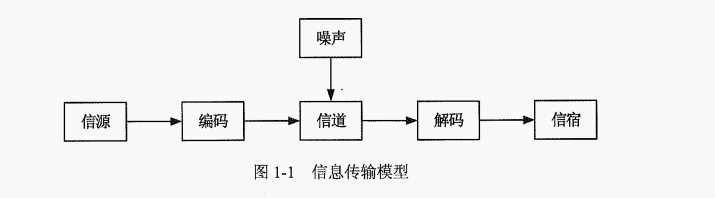

1. **信源**：产生信息的实体，信息产生后，由这个实体向外传播。

2. **信宿**：信息的归宿或接受者

3. **信道**：传送信息的通道，如TCP/IP网络。

4. **编码器**：在信息论中是泛指所有变换信号的设备，实际上就是终端机的发送部分。

5. **译码器**：是编码器的逆变换设备，把信道上送来的信号（原始信息与噪声的叠加)转换成信宿能接受的信号，

6. **噪声**：噪声可以理解为干扰，干扰可以来自于信息系统分层结构的任何一层，当噪声携带的信息大到一定程度的时候，在信道中传输的信息可以被噪声淹没导致传输失败。

    **概括起来，信息系统的基本规律应包括信息的度量、信源特性和信源编码、信道特性和信道编码、检测理论、估计理论以及密码学。**

#### 信息的质量属性

1. **精确性**（对事物状态描述的精准程度）
2. **完整性**（对事物状态描述的全面程度，完整信息应包括所有重要事实。）
3. **可靠性**（指信息的来源、采集方法、传输过程是可以信任的，符合预期。）
4. **及时性**（指获得信息的时刻与事件发生时刻的间隔长短。昨天的天气信息不论怎样精确、完整，对指导明天的穿衣并无帮助，从这个角度出发，这个信息的价值为零。）
5. **经济性**（指信息获取、传输带来的成本在可以接受的范围之内。）
6. **可验证性**（指信息的主要质量属性可以被证实或者证伪的程度。）
7. **安全性**（指在信息的生命周期中，信息可以被非授权访问的可能性，可能性越低，安全性越高。）

#### 系统的定义

系统是指由一系列相互影响、相互联系的若干组成部件，在规则的约束下构成的有机整体，这个整体具有其各个组成部件所没有的新的性质和功能，并可以和其他系统或者外部环境发生交互作用。

#### 系统的功能

系统在接受外部信息，并向系统外部输出信息或对外部环境发生作用的过程中所表现出来的效能或者特征，就是系统的功能。

系统的各组成部分之间、组成部分与整体之间，以及整体与环境之间，存在着一定的有机联系，从而在系统的内部和外部形成一定的结构和秩序。系统的形成、发展、变化的动态过程可以分解为活动。

#### 信息系统具有的特点：

1. **目的性**（定义一个系统、组成一个系统或者抽象出一个系统，都有明确的目标或者目的，目标性决定了系统的功能。）
2. **可嵌套性**（系统可以包括若干子系统，系统之间也能够耦合成一个更大的系统。换句话说，组成系统的部件也可以是系统。这个特点便于对系统进行分层、分部管理、研究或者建设。）
3. **稳定性**（系统的稳定性是指：受规则的约束，系统的内部结构和秩序应是可以预见的：系统的状态以及演化路径有限并能被预测；系统的功能发生作用导致的后果也是可以预估的。稳定性强的系统使得系统在受到外部作用的同时，内部结构和秩序仍然能够保持。）
4. **开放性**（系统的开放性是指系统的可访问性。这个特性决定了系统可以被外部环境识别，外部环境或者其他系统可以按照预定的方法，使用系统的功能或者影响系统的行为。系统的开放性体现在系统有可以清晰描述并被准确识别、理解的所谓接口层面上。）
5. **脆弱性**（这个特性与系统的稳定性相对应，即系统可能存在着丧失结构、功能、秩序的特性，这个特性往往是隐藏不易被外界感知的。脆弱性差的系统，一旦被侵入，整体性会被破坏，甚至面临崩溃，系统瓦解。）
6. **健壮性**（当系统面临干扰、输入错误、入侵等因素时，系统可能会出现非预期的状态而丧失原有功能、出现错误甚至表现出破坏功能。系统具有的能够抵御出现非预期状态的特性称为健壮性，也叫鲁棒性(robustness)。要求具有高可用性的信息系统，会采取冗余技术、容错技术、身份识别技术、可靠性技术等来抵御系统出现非预期的状态，保持系统的稳定性。）

#### 信息系统的定义

信息系统是一种以处理信息为目的的专门的系统类型。信息系统可以是手工的，也可以是计算机化的，本书中讨论是计算机化的信息系统。信息系统的组成部件包括硬件、软件、数据库、网络、存储设备、感知设备、外设、人员以及把数据处理成信息的规程等。

#### 信息系统的生命周期

信息系统的目的、性能、内部结构和秩序、外部接口和部件组成等等由人来规划，它的产生、建设、运行、完善构成一个循环的过程，这个过程遵循一定的规律，为了工程化的需要，有必要把这个过程划分为一些具有典型特点的阶段，每个阶段有不同的目标、工作方法，阶段中的任务也由不同类型的人员来负责。这个过程称为信息系统的生命周期。

软件在信息系统中属于较复杂的部件，可以借用软件的生命周期来表示信息系统的生命周期，

软件的生命周期通常包括：可行性分析与项目开发计划、需求分析、概要设计、详细设计、编码、测试、维护等阶段

信息系统的生命周期包括：系统规划（可行性分析与项目开发计划)、系统分析（需求分析）、系统设计（概要设计、详细设计）、系统实施（编码、测试）、运行维护等阶段

针对信息系统的项目管理，信息系统的生命周期简化为：立项（系统规划）、开发（系统分析、系统设计、系统实施)、运维、消亡四个阶段（在开发阶段不仅包括系统分析、系统设计、系统实施，还包括系统验收等工作）

从项目管理的角度来看，项目的生命周期划分：启动、计划、执行和收尾等4个典型的阶段。

#### 信息化

信息化从“小”到“大”分成以下5个层次：

1. 产品信息化

2. 企业信息化。

3. 产业信息化。

4. 国民经济信息化。

5. 社会生活信息化。

    

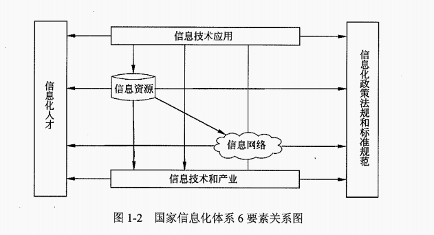

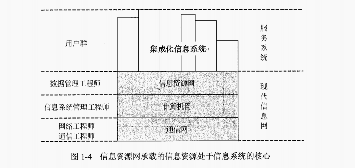

#### 信息资源与自然资源、物质资源相比，具有以下7个特点：

1. 能够重复使用，其价值在使用中得到体现：
2. 信息资源的利用具有很强的目标导向，不同的信息在不同的用户中体现不同的价值；
3. 具有广泛性。人们对其检索和利用，不受时间、空间、语言、地域和行业的制约；
4. 是社会公共财富，也是商品，可以被交易或者交换；具有流动性，通过信息网可以快速传输；
5. 多态性，信息资源可以以数字、文字、图像、声音、视频等多种形态存在；
6. 融合性，整合不同的信息资源并分析、挖掘，可以得到新的知识，取得比分散信息资源更高的价值。

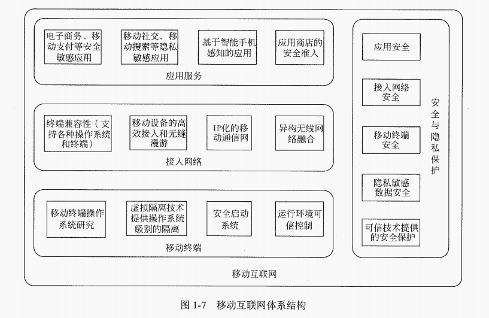

## 信息系统集成服务及管理

------

#### 在我国的信息化建设过程中，信息系统集成及服务普遍存在的主要问题：

1. 系统质量不能满足应用的基本需求；
2. 工程进度拖后延期；
3. 项目资金使用不合理或严重超出预算；
4. 项目文档不全甚至严重缺失；
5. 在项目实施过程中系统业务需求一变再变；
6. 在项目实施过程中经常出现扯皮、推诿现象；
7. 系统存在着安全漏洞和隐患；
8. 重硬件轻软件，重开发轻维护，重建设轻应用；
9. 信息系统服务企业缺乏规范的流程和能力管理；
10. 信息系统建设普遍存在产品化与个性化需求的矛盾；
11. 开放性要求高，而标准和规范更新快。

#### 造成信息系统集成及服务普遍存在的主要问题

1. 不具备技术实力的系统集成商搅乱信息系统集成及服务市场；
2. 一些建设单位在选择项目承建商和进行业务需求分析方面经验不足；
3. 信息系统集成及服务企业自身建设有待加强；
4. 缺乏相应的机制和制度；
5. 企业能力建设缺乏相关的指导标准；

#### 对应的解决办法

1. 信息系统集成、运维服务和信息系统监理资质管理；
2. 信息系统集成、运维服务和信息系统监理相关人员管理；
3. 国家计划（投资）部门对规范的、具备信息系统项目管理能力的企业和人员的建议性要求；
4. 信息系统用户对规范的、具备信息系统项目管理能力的企业和人员市场性需求；

#### 实施ITSM的根本目标有以下三个。

1. 以客户为中心提供IT服务。
2. 提供高质量、低成本的服务。
3. 提供的服务是可准确计价的。

#### ITSM的基本原理

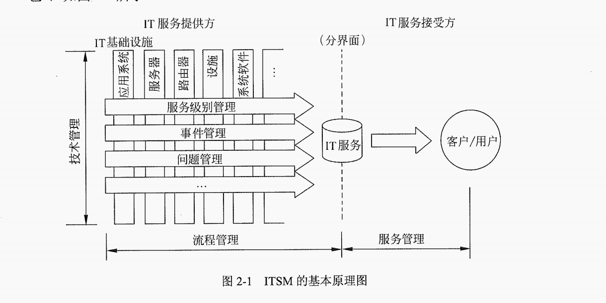

#### ITSM的价值

- **商业价值**
    1. 确保IT流程支撑业务流程，整体上提高了业务运营的质量。
    2. 通过事件管理流程、变更管理流程和服务台等提供了更可靠的业务支持。
    3. 客户对IT有更合理的期望，并更加清楚为达到这些期望他们所需要的付出。
    4. 提高了客户和业务人员的生产率。
    5. 提供更加及时有效的业务持续性服务。
    6. 客户和IT服务提供者之间建立更加融洽的工作关系。
    7. 提高了客户满意度。
- **财务价值**。IT服务管理不但提供商业价值，而且使企业在财务上直接受益
    1. 降低了实施变更的成本。
    2. 当软件或硬件不再使用时，可以及时取消对其的维护合同。
    3. “量体裁衣”的能力，即根据实际需要提供适当的能力，如磁盘容量。
    4. 恰当的服务持续性费用
- **内部价值和创新价值**。包括：
    1. IT服务提供方更为清楚地理解客户的需求，确保IT服务有效支撑业务流程。
    2. 更多地了解当前提供的IT服务的有关信息。
    3. 改进IT支持，使业务部门能够更加灵活地使用IT。
    4. 提高了服务的灵活性和可适应性。
    5. 提高了预知未来发展趋势的能力，从而能够更加迅速地采用新的服务需求和进行相应的市场开发。
- **员工利益**，例如：
    1. IT人员更加清楚了解对他们的期望，并有合适的流程和相应的培训以确保他们能够实现这些期望。
    2. 提高IT人员的生产率。
    3. 提高了IT人员的士气和工作满意度。
    4. 使IT部门的价值得到更好的体现，从而提高了员工的工作积极性。

#### ITSS(Information Technology Service Standards,信息技术服务标维)：

​		是一套成体系和综合配套的信息技术服务标准库，全面规范了IT服务产品及其组成要素，用于指导实施标准化和可信赖的IT服务。

- 原理：

    ITSS借鉴了质量管理原理和过程改进方法的精髓，规定了IT服务的组成要素和生命周期，并对其进行标准化

    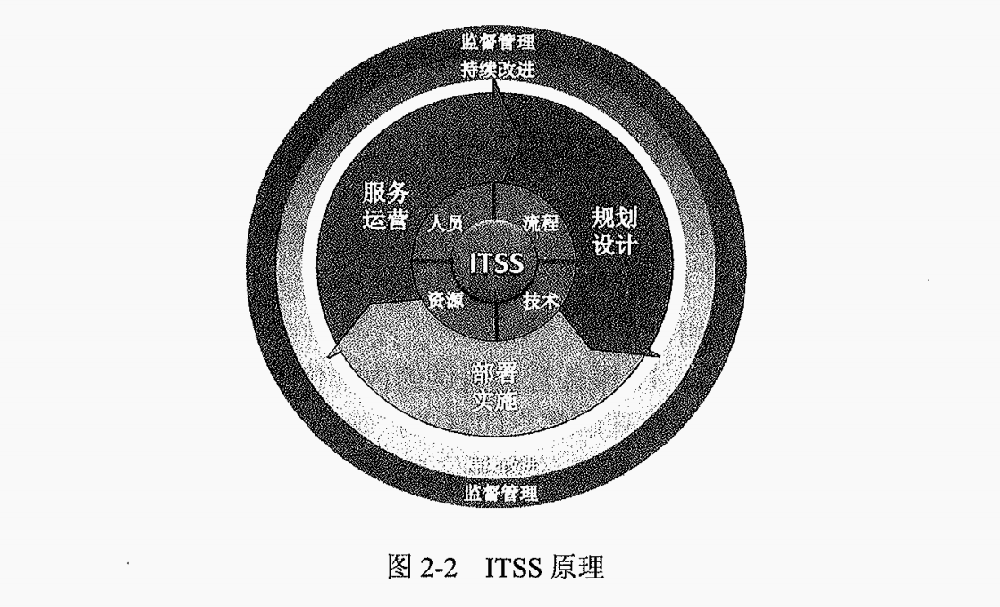

    1. **组成要素**：IT服务由人员(People)、流程(Process)、技术(Technology)和资源(Resource)组成，简称PPTR。其中：

        - **人员**：指提供IT服务所需的人员及其知识、经验和技能要求
        - **流程**：指提供IT服务时，合理利用必要的资源，将输入转化为输出的一组相互关联和结构化的活动
        - **技术**：指交付满足质量要求的T服务应使用的技术或应具备的技术能力
        - **资源**：指提供IT服务所依存和产生的有形及无形资产

    2. **生命周期**：IT服务生命周期由规划设计(Planning&Design)、部署实施(Implementing)、服务运营(Operation)、持续改进(Improvement).和监督管理(Supervision)组成，简称PIOIS。其中：

        - **规划设计**：从客户业务战略出发，以需求为中心，参照ITSS对IT服务进行全面系统的战略规划和设计，为IT服务的部署实施做好准备，以确保提供满足客户需求的IT服务

        - **部署实施**：在规划设计基础上，依据ITSS建立管理体系、部署专用工具及服务解方案；

        - **服务运营**：根据服务部署情况，依据ITSS,采用过程方法，全面管理基础设施、服务流程、人员和业务连续性，实现业务运营与IT服务运营融合；

        - **持续改进**：根据服务运营的实际情况，定期评审IT服务满足业务运营的情况，以及IT服务本身存在的缺陷，提出改进策略和方案，并对T服务进行重新规划设计和部署实施，以提高IT服务质量；

        - **监督管理**：本阶段主要依据ITSS对IT服务服务质量进行评价，并对服务供方的服务过程、交付结果实施监督和绩效评估。

            

    **信息技术服务**：是指供方为需方提供如何开发、应用信息技术的服务，以及供方以信息技术为手段提供支持需方业务活动的服务。常见服务形态有信息技术咨询服务、设计与开发服务、信息系统集成服务、数据处理和运营服务及其他信息技术服务。

    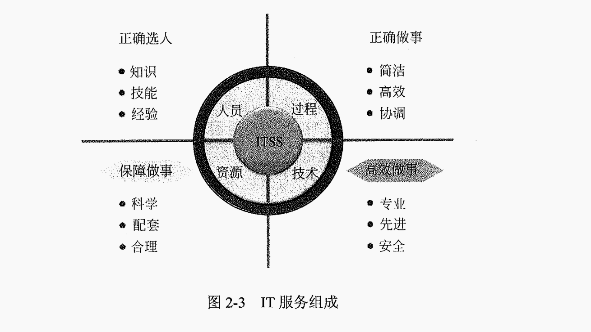

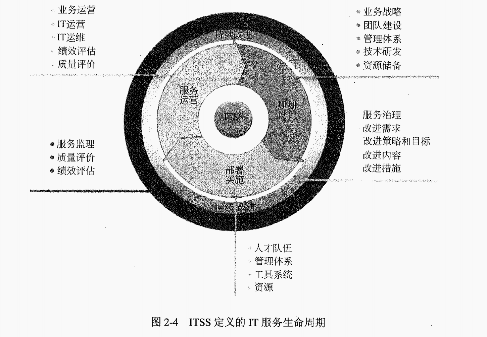

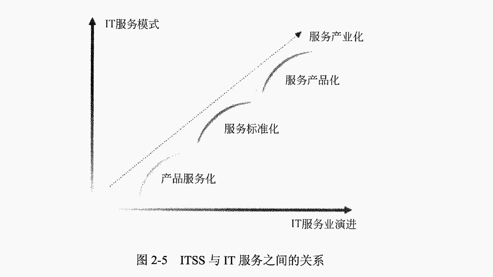

#### 信息技术的标准化和产业化

- **产品服务化**：软件服务化已成为软件产业发展的主要方向之一，特别是云计算、物联网、移动互联网等新模式新技术的不断出现，改变了软件的生产和销售模式，软件即服务(SaaS)、平台即服务(Paas)、基础设施即服务(IaaS)等业务形态的出现，促使软件企业以产品为基础向服务转型。
- **服务标准化**：标准化是确保服务实现专业化、规模化生产的前提，也是规范服务市场的重要手段。在服务标准化的过程中，ITSS的核心作用是确定IT服务的范围和内容，规范组成服务的人员、过程、技术及资源等要素，从而为IT服务的规划化生产和消费奠定基础。
- **服务产品化**：产品化是实现产业化的前提和基础，只有用户对市场中存在的服务产品达到一致认识的前提下，服务的规模化生产和消费才能成为可能。总的来说，产品服务化是前提，服务标准化是保障，服务产品化是趋势。

由此三项构成了**服务产业化**进程

#### ITSS体系的分类标准及主要内容:

- **基础标准**：基础标准旨在阐述信息技术服务的业务分类、服务级别协议、服务质量评价方法、服务人员能力要求等；
- **服务管控标准**：服务管控标准是指通过对信息技术服务的治理、管理和监理活动，以确保信息技术服务的经济有效；
- **服务外包标准**：服务外包标准是对信息技术服务采用外包方式时的通用要求及规范；
- **业务标准**：业务标准按业务类型分为面向IT的服务标准（咨询设计标准、集成实施标准和运行维护标准)和IT驱动的服务标准（服务运营标准），按标准编写目的分为通用要求、服务规范和实施指南，其中通用要求是对各业务类型的基本能力要素的要求，服务规范是对服务内容和行为的规范，实施指南是对服务的落地指导；
- **安全标准**：服务安全标准重点规定事前预防、事中控制、事后审计服务安全以及整个过程的持续改进，并提出组织的服务安全治理规范，以确保服务安全可控；
- **行业应用标准**：行业应用标准是对各行业进行定制化应用落地的实施指南。

#### ITSS体系框架

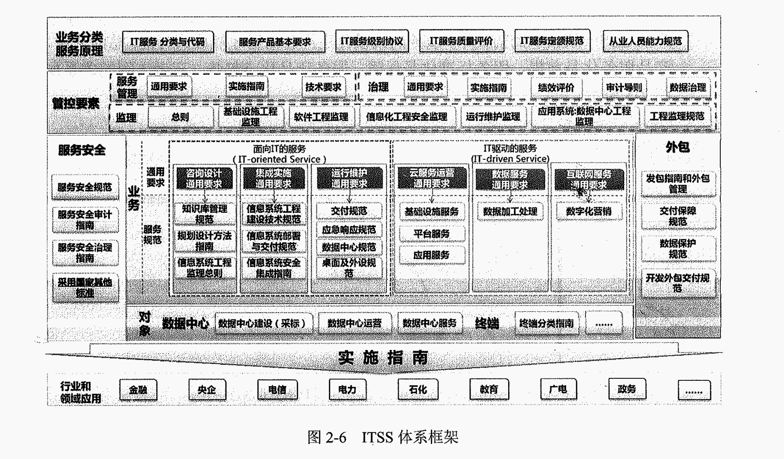

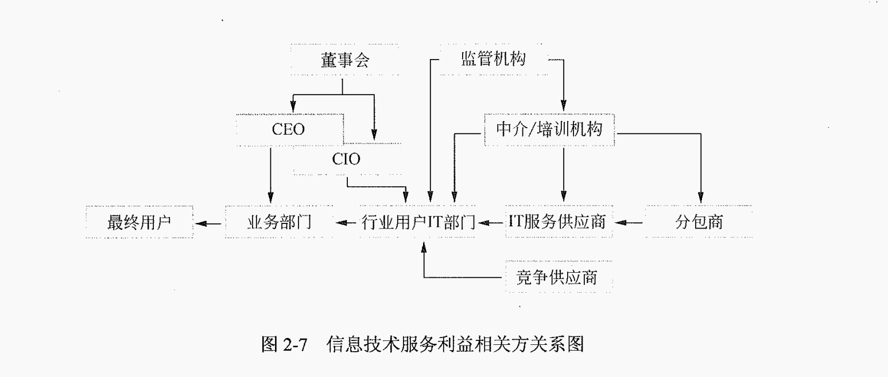

#### 信息系统审计

##### 信息系统审计的关注点：

- 可用性：商业高度依赖的信息系统能否在任何需要的时刻提供服务？信息系统是否被完好保护以应对各种损失和灾难？
- 保密性：系统保存的信息是否仅对需要这些信息的人员开放，而不对其他任何人开放？
- 完整性：信息系统提供的信息是否始终保持正确、可信、及时？能否防止未授权的对系统数据和软件的修改？

##### 信息系统审计的理论基础：

- 传统审计理论
- 信息系统管理理论
- 行为科学理论
- 计算机科学

##### 信息系统审计的基本业务：

- 系统开发审计，包括开发过程的审计、开发方法的审计，为IT规划指导委员会及变革控制委员会提供咨询服务。
- 主要数据中心、网络、通信设施的结构审计，包括财务系统和非财务系统的应用审计。
- 支持其他审计人员的工作，为财务审计人员与经营审计人员提供技术支持和培训。
- 为组织提供增值服务，为管理信息系统人员提供技术、控制与安全指导；推动风险自评估程序的执行。
- 软件及硬件供应商及外包服务商提供的方案、产品及服务质量是否与合同相符审计。
- 灾难恢复和业务持续计划审计。
- 对系统运营效能、投资回报率及应用开发测试审。
- 系统的安全审计。
- 网站的信誉审计。
- 全面控制审计等。

##### 信息系统审计的主要组成部分：

- 信息系统的管理、规划与组织：评价信息系统的管理、计划与组织方面的策略、政策、标准、程序和相关实务。
- 信息系统技术基础设施与操作实务：评价组织在技术与操作基础设施的管理和实施方面的有效性及效率，以确保其充分支持组织的商业目标。
- 资产的保护：对逻辑、环境与信息技术基础设施的安全性进行评价，确保其能支持组织保护信息资产的需要，防止信息资产在未经授权的情况下被使用、披露、修改、损坏或丢失。
- 灾难恢复与业务持续计划：这些计划是在发生灾难时，能够使组织持续进行业务，对这种计划的建立和维护流程需要进行评价。
- 应用系统开发、获得、实施与维护：对应用系统的开发、获得、实施与维护方面所采用的方法和流程进行评价，以确保其满足组织的业务目标。
- 业务流程评价与风险管理：评估业务系统与处理流程，确保根据组织的业务目标对相应风险实施管理。

##### 信息系统审计的依据:

- 一般公认信息系统审计准则
- 信息系统的控制目标
- 其他法律及规定

##### COBIT5的五条基本原则：

- 满足利益相关者需求；
- 端到端覆盖企业；
- 采用单一集成框架；
- 启用一种综合的方法；
- 区分治理和管理。

##### 信息系统审计流程

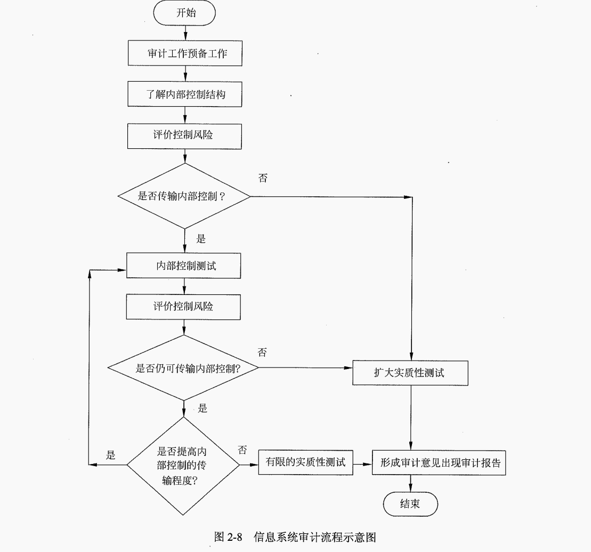

##### 基于风险方法来进行审计的步骤：

- 编制组织使用的信息系统清单并对其进行分类。
- 决定哪些系统影响关键功能和资产。
- 评估哪些风险影响这些系统及对商业运作的冲击。
- 在上述评估的基础上对系统分级，决定审计优先值、资源、进度和频率。审计者可以制定年度审计计划，开列出一年之中要进行的审计项目。

## 信息系统集成专业技术知识

------

### 信息系统建设

#### 信息系统生命周期

​		信息系统建设的内容主要包括设备采购、系统集成、软件开发和运维服务等。
​		信息系统集成是指将计算机软件、硬件、网络通信、信息安全等技术和产品集成为能够满足用户特定需求的信息系统。

其分为四个阶段：

1. **立项阶段**：即概念阶段或需求阶段，这一阶段根据用户业务发展和经营管理的需要，提出建设信息系统的初步构想；然后对企业信息系统的需求进行深入调研和分析，形成《需求规格说明书》并确定立项。
2. **开发阶段**：以立项阶段所做的需求分析为基础，进行总体规划。之后，通过系统分析、系统设计、系统实施、系统验收等工作实现并交付系统。
3. **运维阶段**：信息系统通过验收，正式移交给用户以后，进入运维阶段。要保障系统正常运行，系统维护是一项必要的工作。系统的运行维护可分为更正性维护、适应性维护、完善性维护、预防性维护等类型。
4. **消亡阶段**：信息系统不可避免地会遇到系统更新改造、功能扩展，甚至废弃重建等情况。对此，在信息系统建设的初期就应该注意系统消亡条件和时机，以及由此而花费的成本。

#### 信息系统开发方法

1. **结构化方法**：是应用最为广泛的一种开发方法。应用结构化系统开发方法，把整个系统的开发过程分为若干阶段，然后依次进行，前一阶段是后一阶段的工作依据，按顺序完成。每个阶段和主要步骤都有明确详尽的文档编制要求，并对其进行有效控制。结构化方法的特点是注重开发过程的整体性和全局性。但其缺点是开发周期长；文档、设计说明繁琐，工作效率低；要求在开发之初全面认识系统的需求，充分预料各种可能发生的变化，但这并不十分现实。
2. **原型法**：其认为在无法全面准确地提出用户需求的情况下，并不要求对系统做全面、详细的分析，而是基于对用户需求的初步理解，先快速开发一个原型系统，然后通过反复修改来实现用户的最终系统需求。原型法的特点在于其对用户的需求是动态响应、逐步纳入的；系统分析、设计与实现都是随着对原型的不断修改而同时完成的，相互之间并无明显界限，也没有明确分工。原型又可以分为抛弃型原型（Throw-It-Away Prototype)和进化型原型(Evolutionary Prototype)两种。
3. **面向对象方法**(Object Oriented,OO):用对象表示客观事物，对象是一个严格模块化的实体，在系统开发中可被共享和重复引用，以达到复用的目的。其关键是能否建立一个全面、合理、统一的模型，既能反映需求对应的问题域，也能被计算机系统对应的求解域所接受。面向对象方法主要涉及分析、设计和实现三个阶段。其特点是在整个开发过程中使用的是同一套工具。整个开发过程实际上都是对面向对象三种模型的建立、补充和验证。因此，其分析、设计和实现三个阶段的界限并非十分明确。

在系统开发实际工作中，往往根据需要将多种开发方法进行组合应用，最终完成全部任务。

### 信息系统设计

- #### 方案设计

    1. **系统总体设计**：包括系统的总体架构方案设计、软件系统的总体架构设计、数据存储的总体设计、计算机和网络系统的方案设计等。
    2. **系统详细设计**：包括代码设计、数据库设计、人/机界面设计、处理过程设计等。

- #### 系统架构

- #### 设备、DBMS及技术选型

### 软件工程

#### 软件需求分析与定义

#### 软件设计、测试与维护

1. **软件设计**：根据软件需求，产生一个软件内部结构的描述，并将其作为软件构造的基础。通过软件设计，描述出软件架构及相关组件之间的接口；然后，进一步详细地描述组件，以便能构造这些组件。通过软件设计得到要实现的各种不同模型，并确定最终方案。其可以划分为软件架构设计（也叫做高层设计）和软件详细设计两个阶段。

2. **软件测试**：测试是为了评价和改进产品质量、识别产品的缺陷和问题而进行的活动。软件测试是针对一个程序的行为，在有限测试用例集合上，动态验证是否达到预期的行为。

    软件测试伴通常可以在概念上划分为单元测试、集成测试和系统测试三个阶段。

3. **软件维护**：将软件维护定义为需要提供软件支持的全部活动。这些活动包括在交付前完成的活动，以及交付后完成的活动。交付前要完成的活动包括交付后的运行计划和维护计划等。交付后的活动包括软件修改、培训、帮助资料等。

    软件维护有如下类型：

    1. **更正性维护**一更正交付后发现的错误
    2. **适应性维护**—使软件产品能够在变化后或变化中的环境中继续使用
    3. **完善性维护**—改进交付后产品的性能和可维护性
    4. **预防性维护**一在软件产品中的潜在错误成为实际错误前，检测并更正它们

#### 软件质量保证及质量评价

​	软件质量指的是软件特性的总和，是软件满足用户需求的能力。

- **软件质量保证**：通过制订计划、实施和完成等活动保证项目生命周期中的软件产品和过程符合其规定的要求。
- **验证与确认**：确定某一活动的产品是否符合活动的需求，最终的软件产品是否达到其意图并满足用户需求。
- **评审与审计**：包括管理评审、技术评审、检查、走查、审计等。

#### 软件配置管理

#### 软件过程管理

​	软件过程管理涉及技术过程和管理过程，通常包括以下几个方面。

1. 项目启动与范围定义：启动项目并确定软件需求。
2. 项目规划：制订计划，其中一个关键点是确定适当的软件生命周期过程，并完成相关的工作。
3. 项目实施：根据计划，并完成相关的工作。
4. 项目监控与评审：确认项目工作是否满足要求，发现问题并解决问题。
5. 项目收尾与关闭：为了项目结束所做的活动。需要项目验收，并在验收后进行归档、事后分析和过程改进等活动。

#### 软件开发工具

- 软件需求工具包括需求建模工具和需求追踪工具
- 软件设计工具包括软件设计创建和检查工具
- 软件构造工具包括程序编辑器、编译器、代码生成器、解释器、调试器等
- 软件测试工具包括测试生成器、测试执行框架、测试评价工具、测试管理工具、性能分析工具
- 软件维护工具包括理解工具（如可视化工具）和再造工具（如重构工具）
- 软件配置管理工具包括追踪工具、版本管理工具和发布工具
- 软件工程管理工具包括项目计划与追踪工具、风险管理工具和度量工具
- 软件工程过程工具包括建模工具、管理工具、软件开发环境
- 软件质量工具包括检查工具和分析工具

#### 软件复用

### 面向对象系统分析与设计

#### 面向对象的基本概念

​	面向对象的基本概念包括对象、类、抽象、封装、继承、多态、接口、消息、组件、复用和模式等。

#### 统一建模语言与可视化建模

​	统一建模语言(Unified Modeling Language,UML)用于对软件进行可视化描述、构造和建立软件系统的文档。UML适用于各种软件开发方法、软件生命周期的各个阶段

UML图提供了对系统进行建模的描述方式，主要包括：

- 用例图(Use Case Diagram)、
- 类图(Class Diagram)、
- 对象图(Object Diagram)、
- 组件图(Component Diagram)、
- 部署图(Deployment Diagram)、
- 状态图(State Diagram)、
- 序列图(Sequence Diagram)、
- 协作图(Collaboration Diagram)、
- 活动图(Activity Diagram)等。（注：UML有不同版本）

#### 面向对象系统分析

#### 面向对象系统设计

### 软件架构

#### 软件架构定义

​	软件总是有架构的。将软件系统划分成多个模块，明确各模块之间的相互作用，组合起来实现系统的全部特性，就是系统架构。

#### 软件架构模式

​	常见的典型架构模式如下：

(1)**管道过滤器模式**：此模式中，每个组件（过滤器）都有一组输入/输出，组件读取输入的数据流，经过内部处理后，产生输出的数据流，该过程主要完成输入流的变换及增量计算。其典型应用包括批处理系统。管道过滤器模式体现了各功能模块高内聚、低耦合的“黑盒”特性，支持软件功能模块的重用，便于系统维护；同时，每个过滤器自己完成数据解析和合成工作（如加密和解密)，易导致系统性能下降，并增加了过滤器具体实现的复杂性。如图所示。

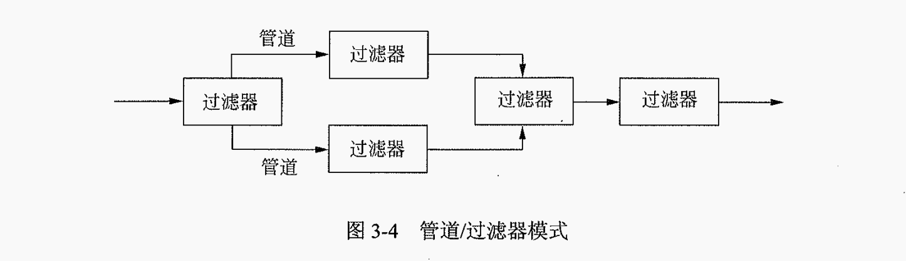

(2)**面向对象模式**：在面向对象的基础上，将模块数据的表示方法及其相应操作封装在更高抽象层次的数据类型或对象中。其典型应用是基于组件的软件开发

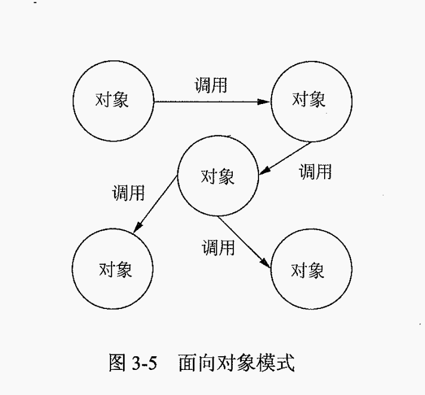

(3)**事件驱动模式**：其基本原理是组件并不直接调用操作，面是触发一个或多个事件。系统中的其他组件可以注册相关的事件，触发一个事件时，系统会自动调用注册了该事件的组件，即触发事件会导致另一组件中操作的调用。其典型应用包括各种图形界面应用。

(4)分层模式：采用层次化的组织方式，每一层都为上一层提供服务，并使用下一层提供的功能。该模式允许将一个复杂问题逐步分层实现。其中的每一层最多只影响相邻两层，只要给相邻层提供相同的接口，就允许每层用不同的方法实现，可以充分支持软件复用。其典型应用是分层通信协议，如ISO/OSI的七层网络模型。此模式也是通用应用架构的基础模式，如图所示。

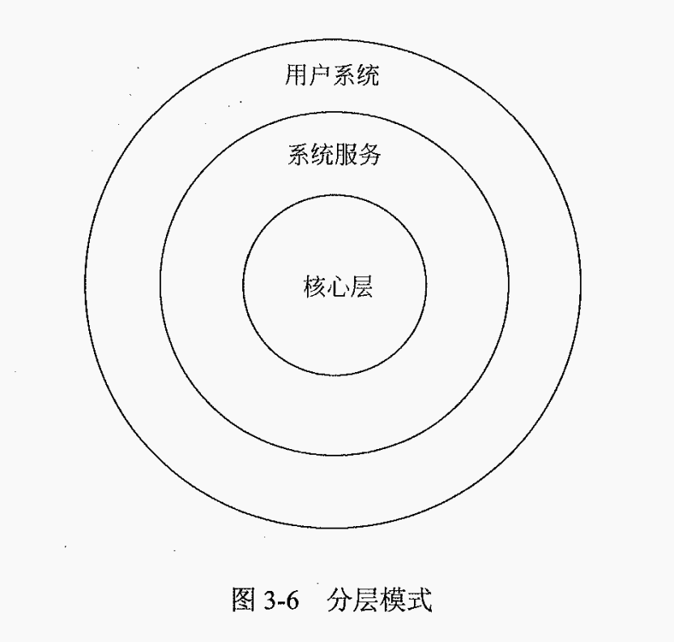

(5)**客户/服务器模式**(Client//Server,C/S):基于资源不对等，为实现共享而提出的模式。C/S模式将应用一分为二，服务器（后台）负责数据操作和事务处理，客户（前台)完成与用户的交互任务。C/S模式中客户与服务器分离，允许网络分布操作，适用于分布式系统。为了解决
C/S模式中客户端的问题，发展形成了浏览器/服务器(Browser/Server,B/S)模式；为了解决CS模式中服务器端的问题，发展形成了三层（多层）CS模式，即多层应用架构。

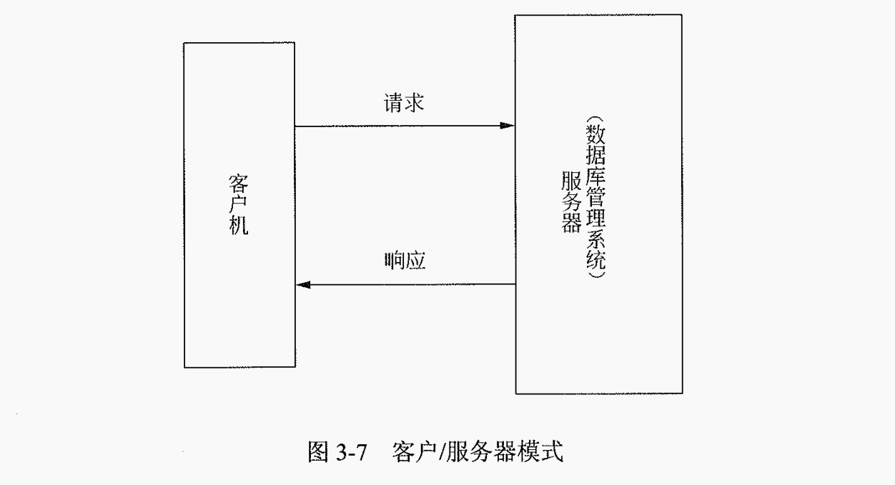

#### 软件架构分析与评估

​	需要考虑的问题：

1. 数据库的选择问题：目前主流的数据库系统是关系数据库。
2. 用户界面选择问题：HTML/HTTP(S)协议是实现Internet应用的重要技术。
3. 灵活性和性能问题：权衡独立于厂商的抽象定义（标准）所提供的灵活性和特定厂商产品带来的性能。
4. 技术选择的问题：选择成熟的技术可以规避项目风险。不仅需要了解技术的优势，还需要了解技术的适用范围和局限性。
5. 人员的问题：聘请经验丰富的架构设计师，可以有效地保证项目的成功。

#### 软件中间件

​	中间件(Middleware)是位于硬件、操作系统等平台和应用之间的通用服务。借由中间件，解决了分布系统的异构问题。

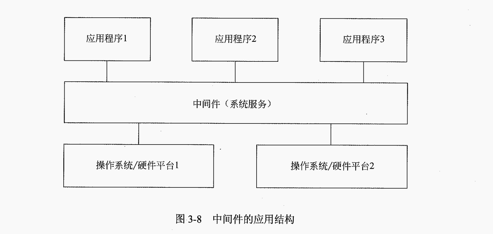

**中间件分类**：数据库访问中间件、远程过程调用中间件、面向消息中间件、事务中间件、分布式对象中间件、事务中间件等。

### 典型应用集成技术

#### 数据库与数据仓库技术

**大数据的特点**：5个V，Volume(数据量大)、Variety(数据类型繁多)、Velocity(处理速度快)、Value(价值密度低)、Veracity(真实性高)。

一般大数据会依托云计算的分布式处理，分布式数据库和云存储，虚拟化技术等

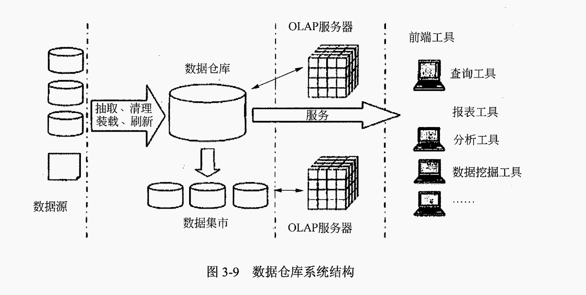

#### Web Services技术

Web服务(Web Services)定义了一种松散的、粗粒度的分布计算模式，使用标准的HTTP(S)协议传送XML表示及封装的内容。随着云计算技术的普及，Web Service逐渐融入到云计算SaaS服务中。

**Web服务的典型技术包括**：用于传递信息的简单对象访问协议(Simple Object Access Protocal.,SOAP)、用于描述服务的Web服务描述语言(Web Services Description Language, WSDL)、用于Web服务注册的统一描述、发现及集成(Universal Description Discovery and Integration,.UDDI)、用于数据交换的XML。

#### JavaEE架构

​	JavaEE应用将开发工作分成两类：业务逻辑开发和表示逻辑开发

​	JavaEE应用服务器运行环境主要包括组件(Component)、容器(Container)及服务(Services)三部分。组件是表示应用逻辑的代码；容器是组件的运行环境；服务则是应用服务器提供的各种功能接口，可以同系统资源进行交互。

#### .NET架构

JavaEE与.NET都可以用来设计、开发企业级应用。

JavaEE平台是业界标准，有多家厂商实现了这些标准（工具、应用服务器等）。.NET是微软的产品系列，而非业界标准。.NET开发框架在通用语言运行环境(Common Language Runtime)基础上，给开发人员提供了完善的基础类库、数据库访问技术及网络开发技术，开发者可以使用多种语言快速构建网络应用。这使二者在实现技术及应用等各方面均有很多不同之处。

#### 软件引擎技术

#### 组件及其在系统集成项目中的重要性

#### 常用组件标准

​	常用组件标准包括微软的COM/DCOM/COM+（具有很强的扩充和扩展能力）、OMG的CORBA及SUN的RMI/EJB。

### 计算机网络知识

​	计算机网络，是指将地理位置不同的具有独立功能的多台计算机及其外部设备，通过通信线路连接起来，在网络操作系统，网络管理软件及网络通信协议的管理和协调下，实现资源共享和信息传递的计算机系统。

#### 网络技术标准与协议

1. **OSI七层协议**

    (1)物理层：该层包括物理连网媒介，如电缆连线连接器。该层的协议产生并检测电压以便发送和接收携带数据的信号。具体标准有RS232、V.35、RJ-45、FDDI。
    (2)数据链路层：它控制网络层与物理层之间的通信。它的主要功能是将从网络层接收到的数据分割成特定的可被物理层传输的帧。常见的协议有IEEE802.3/.2、HDLC、PPP、ATM。
    (3)网络层：其主要功能是将网络地址（例如，P地址）翻译成对应的物理地址（例如，网卡地址)，并决定如何将数据从发送方路由到接收方。在TCP/IP协议中，网络层具体协议有IP、ICMP、IGMP、IPX、ARP等。

    (4)传输层：主要负责确保数据可靠、顺序、无错地从A点到传输到B点。如提供建立、维护和拆除传送连接的功能；选择网络层提供最合适的服务；在系统之间提供可靠的透明的数据传送，提供端到端的错误恢复和流量控制。在TCPP协议中，具体协议有TCP、UDP、SPX。
    (5)会话层：负责在网络中的两节点之间建立和维持通信，以及提供交互会话的管理功能，如三种数据流方向的控制，即一路交互、两路交替和两路同时会话模式。常见的协议有RPC、SQL、NFS。
    (6)表示层：如同应用程序和网络之间的翻译官，在表示层，数据将按照网络能理解的方案进行格式化；这种格式化也因所使用网络的类型不同而不同。表示层管理数据的解密加密、数据转换、格式化和文本压缩。常见的协议有JPEG、ASCII、GIF、DES、MPEG。
    (7)应用层：负责对软件提供接口以使程序能使用网络服务，如事务处理程序、文件传送协议和网络管理等。在TCP/IP协议中，常见的协议有HTTP、Telnet、FTP、SMTP。

2. 网络协议和标准

#### Internet技术及应用

​	Internet有如下特点：

- TCP/IP协议是Internet的核心
- Internet实现了与公用电话交换网（包括移动电话网）的互连
- Internet是一个用户自己的网络
- 由众多的计算机网络互联组成，是一个世界性的网络
- 采用分组交换技术
- 由众多的路由器、网关连接而成
- 是一个信息资源网

如何解决庞大数量的终端之间互联互通呢？Internet采用了TCP/IP和标志技术。

1. TCP/IP

    ​	TCP/IP的层次模型分为四层，其最高层相当于OSI的5-7层,TCP/IP的次高层相当于OSI的传输层,TCP/IP的第二层相当于OSI的网络层,TCP/IP的最底层为网络接口层

2. 标志技术

    - 主机IP地址
    - 域名系统和统一资源定位器

3. 用户E-mail地址

Internet技术在生产和生活中有着广泛的应用：

- 电子商务：B2B、B2C、C2C
- 电子政务：政府信息化应用
- 互联网金融：P2P
- 网络教育：e-Learning
- 网络传媒：网媒、综合门户、富媒体等
- 产业应用：在线行业应用
- 个人应用：地区门户、论坛、搜索引擎、SNS等
- 主题应用：各细分主题网站，比如旅游等。

#### 网络分类

- **根据计算机网络覆盖的地理范围分类**：局域网、城域网和广域网
- **根据链路传输控制技术分类**：总线争用技术、令牌技术、FDDI技术、ATM技术、帧中继技术和ISDN技术。对应上述技术的网络分别是以太网、令牌网、FDDI网、ATM网、帧中继网和ISDN网
- **根据网络拓扑结构分类**：总线型结构、环型结构、星型结构、树型结构和网状结构。

#### 网络服务器

​	网络服务器是指在网络环境下运行相应的应用软件，为网上用户提供共享信息资源和各种服务的一种高性能计算机，英文名称叫做Server。

#### 网络交换技术

​	网络交换是指通过一定的设备，如交换机等，将不同的信号或者信号形式转换为对方可识别的信号类型从面达到通信目的的一种交换形式，常见的有数据交换、线路交换、报文交换和分组交换。

​	按照交换层次的不同，网络交换可以分为物理层交换（如电话网）、链路层交换（二层交换，对MAC地址进行变更）、网络层交换（三层交换，对IP地址进行变更)、传输层交换（四层交换，对端口进行变更，比较少见）和应用层交换（拟乎可以理解为Web网关等)。

​	网络中的数据交换可以分为电路交换、分组交换（数据包交换）、ATM交换、全光交换和标记交换。其中电路交换有预留，且分配一定空间，提供专用的网络资源，提供有保证的服务，应用于电话网；而分组交换无预留，且不分配空间，存在网络资源争用，提供有无保证的服务。分组交换可用于数据报网络和虚电路网络。我们常用的Internet就是数据报网络，单位是Bit,而ATM则用的是虚电路网络，单位是码元。

#### 网络存储技术

​	网络存储技术(Network Storage Technology)是基于数据存储的一种通用网络术语。网络存储结构大致分为3种：直连式存储(DAS: Direct Attached Storage)、网络存储设备(NAS: Network Attached Storage)和存储网络(SAN: Storage Area Network)。

#### 光网络技术

​	光网络技术通常可分为光传输技术、光节点技术和光接入技术，它们之间有交叉和融合。

​	全光网(AON)是指信息从源节点到目的节点完全在光域进行，即全部采用光波技术完成信息的传输和交换的宽带网络。

#### 无线网络技术

​	无线网络是指以无线电波作为信息传输媒介

​	无线通信网络根据应用领域可分为：无线个域网(WPAN)、无线局域网(WLAN)、无线城域网(WMAN)、蜂房移动通信网(WWAN)

​	在无线通信领域，通常叫第几代(Generation,简称G)通信技术

#### 网络接入技术

​	网络接入技术分为光纤接入、同轴接入、铜线接入、无线接入。

#### 综合布线、机房工程

机房是系统集成工程中服务器和网络设备的“家”，通常分为以下3类：

- 智能建筑弱电总控机房，工作包括布线、监控、消防、计算机机房、楼宇自控等；
- 电信间、弱电间和竖井；
- 数据中心机房，包括企业自用数据中心、运营商托管或互联网数据中心，大型的数据中心，可达数万台服务器。

机房布线设计需要重点考虑以下几点：

- 考虑机房环境的节能、环保、安全
- 适应冷热通道布置设备
- 列头柜的设置
- 敞开布线与线缆防火
- 长跳线短链路与性能测试
- 网络构架与外部网络，多运营商之间的网络互通
- 高端产品应用的特殊情况
- 机房与布线系统接地

#### 网络规划、设计与实施

网络设计工作包括：

- **网络拓扑结构设计**：从逻辑连接看拓扑结构只能是总线结构。
- **主干网络(核心层)设计**：主干网技术的选择，要根据以上需求分析中用户方网络规模大小、网上传输信息的种类和用户方可投入的资金等因素来考虑。一般而言，主干网用来连接建筑群和服务器群，可能会容纳网络上50%~80%的信息流，是网络大动脉。
- **汇聚层和接入层设计**：汇聚层的存在与否，取决于网络规模的大小。（交换机）
- **广域网连接与远程访问设计**：根据网络规模的大小、网络用户的数量，来选择对外连接通道的带宽。
- **无线网络设计**：无线网络的出现就是为了解决有线网络无法克服的困难（10Mbps）
- **网络通信设备选型**：核心交换机选型、汇聚层/接入层交换机选型、远程接入与访问设备选型。

#### 网络安全

​	网络安全是指网络系统的硬件、软件及其系统中的数据受到保护，不因偶然的或者恶意的原因而遭受到破坏、更改、泄露，系统连续可靠正常地运行，网络服务不中断。

信息安全的基本要素有：

1. **机密性**：确保信息不暴露给未授权的实体或进程。
2. **完整性**：只有得到允许的人才能修改数据，并且能够判别出数据是否已被篡改。
3. **可用性**：得到授权的实体在需要时可访问数据，即攻击者不能占用所有的资源而阻碍授权者的工作。
4. **可控性**：可以控制授权范围内的信息流向及行为方式。
5. **可审查性**：对出现的网络安全问题提供调查的依据和手段。

​	为了达成上述目标，需要做的工作有：**制定安全策略、用户验证、加密、访问控制、审计和管理**。

​	网络安全分为**内部安全**和**外部安全**。

​	典型的网络攻击步骤一般为：**信息收集、试探寻找突破口、实施攻击、消除记录、保留访问权限**。

**主要的网络和信息安全产品**：

1. 防火墙
2. 扫描器
3. 防毒软件
4. 安全审计系统

#### 网络管理

网络管理包括对硬件、软件和人力的使用、综合与协调，以便对网络资源进行监视、测试、配置、分析、评价和控制

需要备份的数据一般包括：

- 工作文档类文件
- E-mail、QQ记录类文件
- 设置类文件
- 系统类文件
- 数据库的备份
- 重要光盘
- 其他重要文件

### 新兴信息技术

#### 云计算

1. 云计算概念

    云计算是指基于互联网的超级计算模式，通过互联网来提供大型计算能力和动态易扩展的虚拟化资源。云是网络、互联网的一种比喻说法。

    其具有的特点：超大规模、虚拟化、高可靠性、通用性、高可扩展性、按需服务、极其廉价、潜在危险性

2. 云计算发展现状：计算时代、网络时代和云时代。

3. 云计算架构：基础设施即服务(IaaS)、平台即服务(PaaS)和软件即服务(SaaS)

    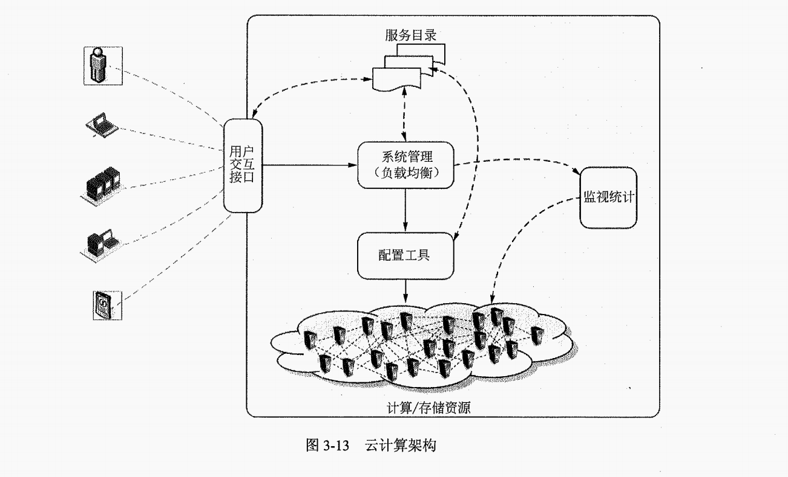

    ​	从云计算的核心以及大型数据中心的内部结构来看，其结构包括：

    1. 资源池：指集群管理的各种基础硬件资源，如CPU、存储和网络带宽等。
    2. 云操作系统：通过虚拟化技术对资源池中的各种资源进行统一调度管理。
    3. 云平台接口：用户调用云计算资源的接口。

4. 云计算应用：

    1. 从服务层次来看，如前所述，云计算的应用可分为基础设施即服务(IaaS)、平台即服务(PaaS)、软件即服务(SaaS)'3个层次。
    2. 从应用范围来看，云计算又可分为公有云、私有云和混合云。公有云通常指第三方提供商提供的用户能够使用的云，公有云一般可通过Internet使用，可能是免费或成本低廉的。私有云是为一个客户单独使用而构建的，因而提供对数据、安全性和服务
        质量的最有效控制。该公司拥有基础设施，并可以控制在此基础设施上部署应用程序的方式。混合云就是将公有、私有两种模式结合起来，根据需要提供统一服务的模式。
    3. 从行业来看，在国内云计算应用较多的行业包括金融、政府、电子商务、游戏、音视频网站、移动应用、门户和社区等

#### 物联网

1. **物联网概念**

    指通过射频识别(RFID)、红外感应器、全球定位系统、激光扫描器等信息传感设备，按约定的协议，把物与物、人与物进行智能化连接，进行信息交换和通讯，以实现智能化识别、定位、跟踪、监控和管理的一种新兴网络。

    从计算机的协同处理来划分：独立计算、互联网、物联网时代

    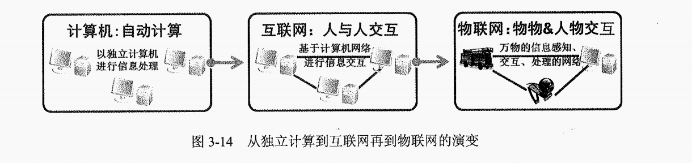

2. **物联网发展现状**：

    1. 技术创新能力显著增强
    2. 初步完成产业体系构建
    3. 应用规模与水平显著提升

3. **物联网架构**：

    1. 感知层：负责信息采集和物物之间的信息传输

    2. 网络层：是利用无线和有线网络对采集的数据进行编码、认证和传输，广泛覆盖的移动通信网络是实现物联网的基础设施

    3. 应用层：提供丰富的基于物联网的应用，是物联网发展的根本目标

        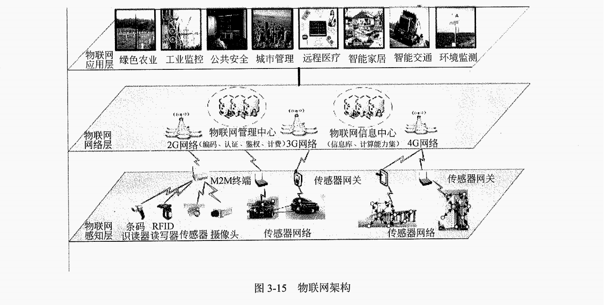

        各个层次所用的公共技术包括编码技术、标识技术、解析技术、安全技术和中间件技术。

4. **物联网关键技术**

    感知层作为物联网架构的基础层面，主要是达到信息采集并将采集到的数据上传的目的，感知层的技术主要包括：产品和传感器（条码、RFD、传感器等）自动识别技术，无线传输技术(WLAN、Bluetooth、ZigBee、UWB),自组织组网技术和中间件技术

5. **物联网应用**

    智能微尘、智能电网、智慧物流、智能家居、智能交通、智慧农业、环境保护、医疗健康、城市管理、金融服务保险业、公共安全

我国物联网产业发展现状：

- 优势产业：仪器仪表、嵌入式系统、软件与集成
- 均势产业：网络通信
- 弱势产业：传感器、RFD、高端软件与集成服务
- 起步产业：物联网相关设备与服务

#### 移动互联网

1. **移动互联网概念**：移动互联网一般是指用户用手机等无线终端，通过移动网络接入互联网，可以在移动状态下（如
    在地铁、公交车上等)使用互联网的网络资源。

    **特征**：接入移动性、时间碎片性、生活相关性、终端多样性

2. **移动互联网发展现状**

3. **移动互联网关键技术**：移动互联网的关键技术包括架构技术SOA、页面展示技术Web2.0和HTML5以及主流开发平台Android、iOS和Windows Phone。

    Service Oriented Architecture,即面向服务的架构

    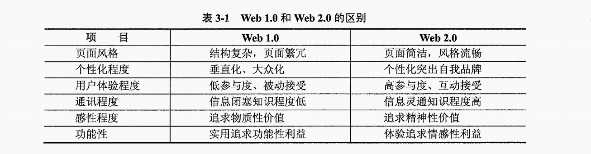

    **HTML5特性**：

    - 支持WebGL、拖曳、离线应用和桌面提醒，大大增强了浏览器的用户使用体验。
    - 支持地理位置定位，更适合移动应用的开发。
    - 支持浏览器页面端的本地储存与本地数据库，加快了页面的反应。
    - 使用语义化标签，标签结构更清晰，且利于SEO。
    - 摆脱对Flash等插件的依赖，使用浏览器的原生接口。
    - 使用CSS3,减少页面对图片的使用。
    - 兼容手机、平板电脑等不同尺寸，不同浏览器的浏览。

    Android

    IOS

    Windows Phone

4. **移动互联网应用**

    - 娱乐类：工作之余的休闲及娱乐需求，包括游戏、音乐、旅游、运动、时尚信息等。
    - 交流类：社交需求与情感交流，包括交友、与亲人之间的感情交流。
    - 学习类：提升自身素质需求，包括外语、专业课程、技能培训等。
    - 生活类：包括购物需求（日用品等)和生活需求（健康、热点新闻、理财、饮食等）。
    - 商务类：工作方面的需求，包括求职、行业信息等。
    - 工具类：为了满足以上需求而进行手机优化、搜索等。

#### 大数据

1. 大数据概念：大数据是指无法在一定时间内用传统数据库软件工具对其内容进行抓取、管理和处理的数据集合。

2. 发展现状

3. 关键技术：大数据所涉及的技术很多，主要包括数据采集、数据存储、数据管理、数据分析与挖掘四个环节。

    Hadoop分布式文件系统(HDFS)、HBase、MapReduce、Chukwa

4. 大数据应用：互联网和电子商务行业、电信/金融、政府、医疗、制造

## 项目管理一般知识

------

### 什么是项目？什么是项目管理？

#### 项目的定义

​	项目是为达到特定的目的，使用一定资源，在确定的期间内，为特定发起人提供独特的产品、服务或成果而进行的一系列相互关联的活动的集合。项目有完整的生命周期，有开始，有结束，具有一次性、临时性的特点。

#### 项目目标

1. **项目目标的概念**

    项目目标包括**成果性目标**（项目目标）和**约束性目标**（管理性目标）

    **成果性目标**：通过项目开发出的满足客户要求的产品、系统、服务或成果

    **约束性目标**：完成项目成果性目标需要的时间、成本以及要求满足的质量

2. **项目目标的特性**

    - 项目的目标有不同的**优先级**
    - 项目的目标具有**层次性**

#### **项目的特点**

1. 临时性：临时性是指每一个项目都有一个明确的开始时间和结束时间，临时性也指项目是一次性的。
2. 独特性：项目要提供某一独特产品，提供独特的服务或成果。
3. 渐进明细：渐进明细指项目的成果性目标是逐步完成的。

#### **信息系统集成项目的特点**

**信息系统集成**：就是从客户和用户的需求出发，将硬件、系统软件、工具软件、网络、数据库、应用软件或者云计算提供的服务以及相关的支撑环境集成为实用的信息系统的过程。在这个过程中，应根据需求，开发相应的软件和硬件，并把它们集成为一个系统。

**信息系统集成项目的产品是满足需求、支持用户业务的信息系统。**
**信息系统集成项目建设的指导方法是“总体规划、分步实施”。**

信息系统集成项目的**特点**：

1. 信息系统集成项目要以满足客户和用户的需求为根本出发点。
2. 客户和用户的需求常常不够明确、复杂多变，由此应加强需求变更管理以控制风险。
3. 系统集成不是简单选择最好产品的行为，而是要选择（或开发）最适合用户的需求和投资规模的产品、技术和服务的活动的集合。
4. 高技术与高技术的集成。
5. 系统工程。系统集成包含技术，管理和商务等方面，是一项综合性的系统工程
6. 项目团队的成员年轻，流动率高。因此对企业的管理技术水平和项目经理的领导艺术水平要求较高。
7. 强调沟通的重要性。

**系统集成项目管理既是一种管理行为又是一种技术行为**

**信息系统集成项目属于典型的多种技术合作的项目，一般需要多种技术的配合**

#### 项目管理的定义及其知识范围

在项目活动中综合运用知识、技能、工具和技术在一定的时、成本、质量等要求下来实现项目的成果性目标的一系列行为。

项目管理的目标一般包括如期完成项目以保证用户需求得到确认和实现，在控制项目成本的基础上保证项目质量，妥善处理用户的需求变动等。

项目管理中应当采用成本与效益匹配、技术先进、充分交流与合作等原则。

项目成功受到范围、时间、成本和质量四个方面的约束

项目管理通过执行一系列相关的过程来完成，这些过程分布在核心知识域、保障域、伴随域和过程域中。值得注意的一点是，在实际工作中，项目管理的很多过程是重叠的和交互的。

- 核心知识域：包含整体管理、范围管理、进度管理、成本管理、质量管理和信息安全管理等。
- 保障域：包含人力资源管理、合同管理、采购管理、风险管理、信息（文档）与配置管理、知识产权管理、法律法规标准规范和职业道德规范等。
- 伴随域：包含变更管理和沟通管理等。
- 过程域：包含科研与立项、启动、计划、实施、监控和收尾等，而其中的监控过程则可能发生在项目生命周期的任一个阶段。

#### **项目管理需要的专业知识技术**

有效的项目管理要求项目管理团队至少能理解和使用以下6方面的专门知识：

1. **项目管理知识体系**

2. **项目应用领域的知识、标准和规定**

    **应用领域**定义范围：

    1. 职能部门和支持领域，如法律、产品和库存管理、市场营销、后勤和人事等
    2. 技术因素，如软件开发、水利和卫生工程、建筑工程等
    3. 管理专业领域，例如政府合同、地区开发和新产品开发等
    4. 工业组织，如汽车、化工、农业和金融服务等

    **标准**：“一致同意建立并由公认的机构批准的文件，该团体提供通用的和可重复使用的规则、指南、活动或其结果的特征，目的是在特定的背景下达到最佳的秩序。”

    **法规**：政府强制的要求，它制定了产品、过程或服务的特征，包括适用的管理条款，并强制遵守。

3. **项目环境知识**：社会环境、政治环境、自然环境

4. **通用的管理知识和技能**：

    包括**财务、计划、组织、人事、执行和控制一个正在运行的企业的运营**。

    它包括一些支持性的学科，如：

    - 财务管理和会计。
    - 购买和采购。
    - 销售和营销。
    - 合同和商业法律。
    - 制造和分配。
    - 后勤和供应链。
    - 战略计划、战术计划和运营计划。
    - 组织结构、组织行为、人事管理、薪资、福利和职业规划。
    - 健康和安全实践。

5. **软技能或人际关系技能**：

    1. 有效的沟通，即有效地交流信息。
    2. 对组织施加影响，即“让事情办成”的能力。
    3. 领导能力，即形成一个前景和战略并组织人员实现它的能力。
    4. 激励，就是激励相关人员达到高水平的生产率并克服变革的阻力。
    5. 谈判和冲突管理，就是与其他人谈判取得一致或达成协议。
    6. 分析和综合归纳能力。
    7. 解决问题，就是首先定义问题、明确问题，然后做出决策并解决问题。

6. **经验、知识、工具和技术**

    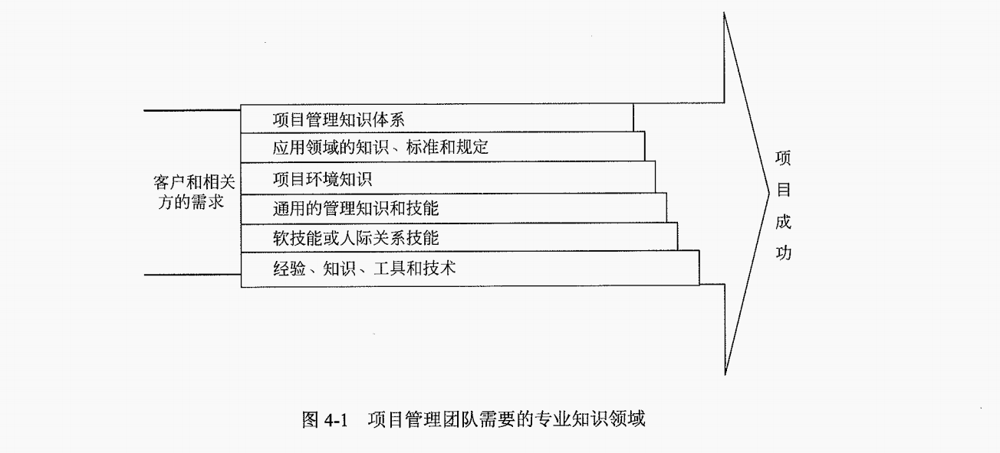

#### 项目管理学科的产生和发展

1. 项目管理学科的产生

    项目管理快速发展的原因：

    1. 适应现代产品的创新速度。
    2. 适应市场环境
    3. 适应现代复杂项目的管理。
    4. 适应以用户满意为核心的服务理念。

2. IPMA和PMI

    1. IPMA和IPMP
    2. 国际项目管理专业资质认证：
        - A级(Level A)证书是认证的高级项目经理
        - B级(Level B)证书是认证的项目经理
        - C级(Level C)证书是认证的项目管理从业人员
        - D级(Level D)证书是认证的项目管理助理员

    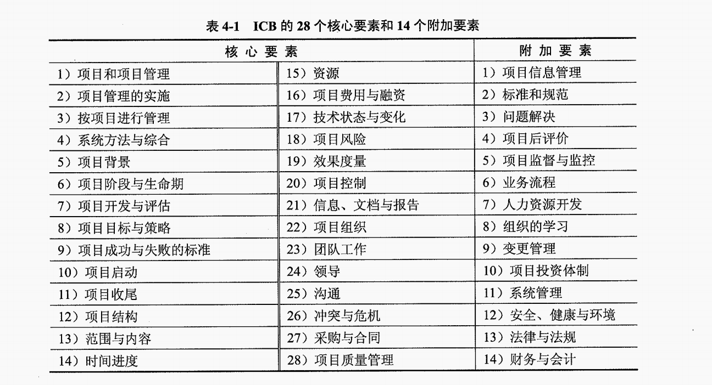

    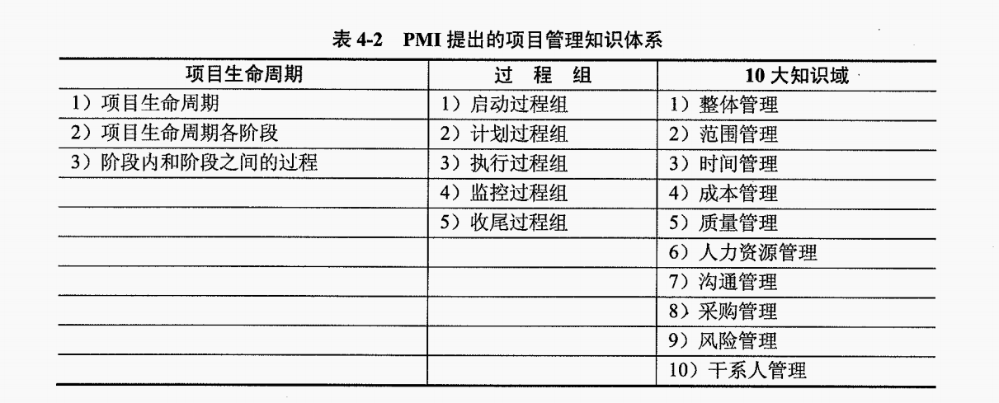

3. 项目管理学科的发展方向

    在管理项目的过程中，至少涉及**建设方、承建方和监理方**三方

    国际项目管理的发展现状：**全球化的发展、多元化的发展、专业化的发展**。

4. 项目管理在中国

    信息产业部在推进项目管理方面所采取的相关措施如下：

    - 实施计算机信息系统集成资质管理制度。
    - 推行项目经理制度。
    - 推行信息系统工程监理制度。

#### 项目经理应该具备的技能和素质

1. **对项目经理的一般要求**

    至少应当具备如下的素质：

    1. **足够的知识**：

        - 项目管理：包括项目管理的理论、方法论和相关工具。
        - 丰富的IT知识。
        - 客户行业的业务知识。
        - 其他必要的知识。

    2. **丰富的项目管理经验**

        包括三个方面的经验：项目管理、系统集成行业和客户行业。

    3. **良好的协调和沟通能力**

    4. **良好的职业道德**

    5. **一定的领导和管理能力**

2. **怎样当好一个优秀的项目经理**

    1. **真正理解项目经理的角色**

    2. **领导并管理项目团队**

    3. **依据项目进展的阶段，组织制订详细程度适宜的项目计划，监控计划的执行，并根据实际情况、客户要求或其他变更要求对计划的变更进行管理**。

        项目经理首先要带领项目团队做出一个科学的、切合实际情况的项目管理计划。计划的特点是：远期计划较粗、近期较细、计划一定得有切实的根据。一旦计划经相关方同意后就要积极执行。在执行过程中，要对计划和实际完成情况进行检查和监控。在推
        进项目的过程中，注意沟通和协调以便顺利完成项目的要求。

    4. **真正理解“一把手工程”**

        **项目领导小组**：建设方的"一把手"应为小组组长，组员来自建设方，承建方、监理方、供应商等

        领导小组负责项目的重大决策、协调单位的之间的协作。项目实施小组接受领导小组的领导，负责项目的实施，一般也由建设方的相关人员担任组长。承建方的项目团队接受实施小组的领导。

        有关项目的重大决策或协调工作，“一把手”一定要参加或参与。

        项目实施团队应该自底向上地定期地（一般为每周或每月）汇报项目的状态，在必要时提议“一把手”召开会议。同时，对于项目经理所在公司的“一把手”也要定期进行汇报和交流，以获取支持、理解和资源的调配。

    5. **注重客户和用户参与**

        项目的目标是开发出满足客户需求的产品，或提交满足客户需求的成果，或提供让客户满意的服务，因此客户和用户的参与必不可少。不仅要调研他们的需求，还要在项目的实施过程中让他们参与到项目中来，让他们真正了解项目，对项目的工作和中间成果给予及时的确认，减少不必要的变更，保证项目顺利地完成。

#### 项目干系人

项目干系人（也叫“**项目利益相关者**”或“**项目利害关系者**”）是**指那些积极参与项目，或是其利益会受到项目执行的影响，或是其利益会受到项目结果影响的个人和组织，他们也可能会对项目及其结果施加影响。**项目管理团队必须明确项目的干系人，确定其需求，然后对这些需求进行管理和施加影响，确保项目取得成功。

每个项目的关键干系人除客户和用户外，还包括如下一些人：

1. 项目经理：负责管理项目的人。
2. 执行组织：指其员工最直接参与项目工作的单位。
3. 项目团队及其成员
4. 项目发起人：为项目分配资金或实物等财力资源的个人或组织。
5. 职能经理：在一个单位内，职能经理为项目经理提供专业技术支持，职能经理职责之一是为项目提供及时和合格的资源（包括人力资源）。在一个单位内，职能经理常常是一个职能部门的“部门经理”。项目管理并非一定要设计成一个统一的指挥体系，而往往是要在项目经理和职能经理之间分享权力和职责。项目经理计划、指挥和控制项目，而职能经理负责专门的技术工作和部门内的行政管理。处理好项目经理同职能经理的关系，使双方能够有效地协调、利用资源，往往是项目成败的关键。
6. 影响者：不直接购买或使用项目产品的个人或团体，但其在客户组织内的地位可能正面或负面地影响项目的进程。
7. 项目管理办公室（Project Management Office,PMO)：如果执行组织内设有项目管理办公室的话，则其直接或间接地对项目结果负有责任。

​	**项目经理必须管理项目干系人的期望，因为项目干系人经常会有相互不同甚至是冲突的目标。**

​	**解决项目干系人之间的不同意见应该以使客户满意为主。但是，这并不意味着可以忽视其他项目干系人的要求和期望。**

​	**找到对分歧的恰当解决方案，是对项目经理主要的挑战。**

#### 项目管理系统

项目管理系统是指用于管理项目的工具、技术、方法、资源和过程组之集合。项目管理计划说明这个系统如何使用，项目管理系统的内容随应用领域、组织影响、项目复杂性、现有系统的有效性等而变化。

#### 事业环境因素

​	在项目启动时，必须考虑涉及并影响项目成功的环境、组织的因素和系统。主要有：

1. 实施单位的企业文化和组织结构；
2. 国家标准或行业标准；
3. 现有的设施和固定资产等；
4. 实施单位现有的人力资源、人员的专业和技能，人力资源管理政策如招聘和解聘的指导方针、员工绩效评估和培训记录等；
5. 当时的市场状况；
6. 项目干系人对风险的承受力；
7. 行业数据库；
8. 项目管理信息系统（可能是工具，也可能是软件，总之能帮助人们管理项目）。

#### 组织过程资产

组织过程资产包含：项目实施组织的企业计划、政策方针、规程、指南和管理系统，实施项目组织的知识和经验教训。

**组织过程资产**可以分成以下两类：

1. **组织中指导工作的过程和程序**
    - 组织的标准过程，例如标准、政策如项目管理政策、公司规定的产品和项目生命周期、质量政策和规定。
    - 标准指导方针、模板、工作指南、建议评估标准、风险模板和性能测量准则。
    - 用于满足项目特定需要的标准过程的修正指南。
    - 为满足项目的特定需求，对组织标准过程集进行剪裁的准则和指南。
    - 组织的沟通要求、汇报制度。
    - 项目收尾指南或要求，例如结项审计、项目评估、产品确认和验收标准指南。
    - 财务控制程序，如汇报周期、必要开支、支出评审、会计编码和标准合同条款。
    - 问题和缺陷管理程序、问题和缺陷的识别和解决、问题追踪。
    - 变更控制流程，包括修改公司正式的标准、方针、计划和程序及任何项目文件，以及批准和确认变更的步骤。
    - 风险控制程序，包括风险的分类、概率和影响定义、概率和影响矩阵。
    - 批准与发布工作授权的程序。
2. **组织的全部知识**
    - 项目档案（完整记录以往每个项目的文件、记录、文档、收尾信息和文档，包括基准文件）。
    - 过程测量数据库，用于收集和提供过程和产品的实测数据。
    - 经验学习系统，包括以前项目的选择决策、以往的项目绩效信息和风险管理经验教训。
    - 问题和缺陷管理数据库，包括问题和缺陷的状态、控制、解决方案和行动项结果。
    - 配置管理知识库，包括所有的正式的公司标准、政策、程序和项目文档的各种版本和基线。
    - 财务数据库，包括劳动时间、产生的费用、预算和项目超支费用等信息。

### 项目的组织方式

#### 组织体系

​	以项目为基础的组织是指他们的业务主要由项目组成，可分为两大类:

1. 其主要收入是源自依照合同为他人履行项目的组织
2. 按逐个项目进行管理的组织：这些组织往往具有便于项目管理的管理系统

​	不以项目管理为手段进行经营的组织通常缺少专门用来支持项目管理需求的管理系统。缺少基于项目的管理系统经常会导致项目管理更加困难。

#### 组织的文化、风格与沟通

​	组织通过对人员和部门的系统化安排，以开展项目等方式实现组织目标。

1. 组织的文化与风格体现在：
    1. 组织的共同价值观、行为准则、信仰和期望。
    2. 组织的方针、办事程序。
    3. 组织对于职权关系的观点。
    4. 职业道德。
    5. 众多其他的因素。
2. 组织的沟通

#### 组织结构

**实施项目的组织结构对能否获得项目所需资源和以何种条件获取资源起着制约作用**。组织结构可以比喻成一条连续的频谱，其一端为职能型，另一端为项目型，中间是形形色色的矩阵型。

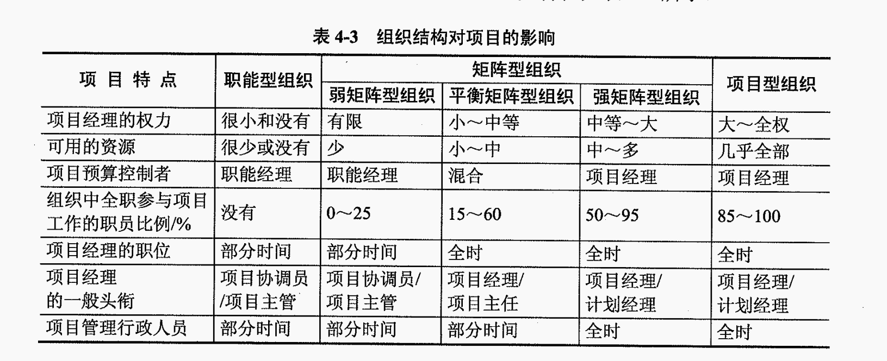

1. **职能型组织**

    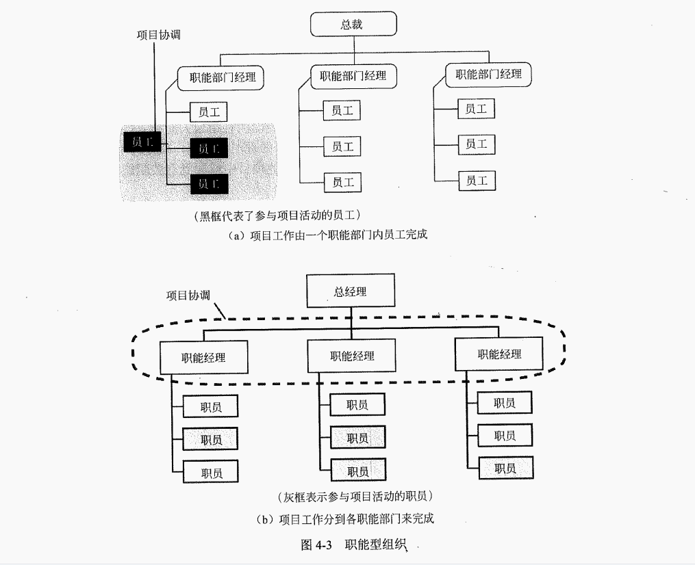

    职能型组织的**优点**：

    1. 强大的技术支持，便于知识、技能和经验的交流。
    2. 清晰的职业生涯晋升路线。
    3. 直线沟通、交流简单、责任和权限很清晰。
    4. 有利于重复性工作为主的过程管理。

    **缺点**：职能利益优先于项目，具有狭险性；组织横门之间的联系薄弱、部门间沟通、协调难度大；项目经理极少或缺少权利、权威；项目管理发展方向不明，缺少项目基准等。

2. **项目型组织**

    在项目型组织中，一个组织被分为一个一个的项目经理部。一般项目团队成员直接隶属于某个项目而不是某个部门。绝大部分的组织资源直接配置到项目工作中，并且项目经理拥有相当大的独立性和权限。项目型组织通常也有部门，但这些部门或是直接向项目经理汇报工作，或是为不同项目提供支持服务。项目结束后，项目成员会另行安排到其他项目中或回到有关职能部门中。

    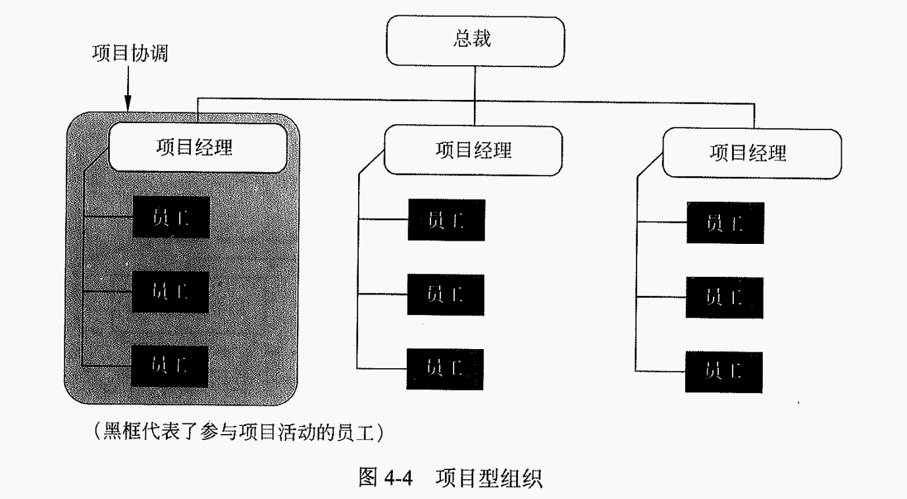

    项目型组织的**优点**：

    1. 结构单一，责权分明，利于统一指挥。
    2. 目标明确单一。
    3. 沟通简洁、方便。
    4. 决策快。

    **缺点**：管理成本过高，如项目的工作量不足则资源配置效率低；项目环境比较封闭，不利于沟通、技术知识等共享；员工缺乏事业上的连续型和保障等。

3. **矩阵型组织**
    在矩阵型组织内，项目团队的成员来自相关部门，同时接受部门经理和项目经理的领导，矩阵型组织兼有职能型和项目型的特征，依据项目经理对资源包括人力资源影响程度，矩阵型组织可分为弱矩阵型组织、平衡矩阵型组织和强矩阵型组织。弱矩阵型组织保持着很多职能型组织的特征，弱矩阵型组织内项目经理对资源的影响力弱于部门经理，项目经理的角色与其说是管理者，更不如说是协调人和发布人。平衡矩阵型组织内项目经理要与职能经理平等地分享权力。同理，强矩阵型组织保持着很多项目型组织的特征，具有拥有很大职权的专职项目经理和专职项目行政管理人员。

    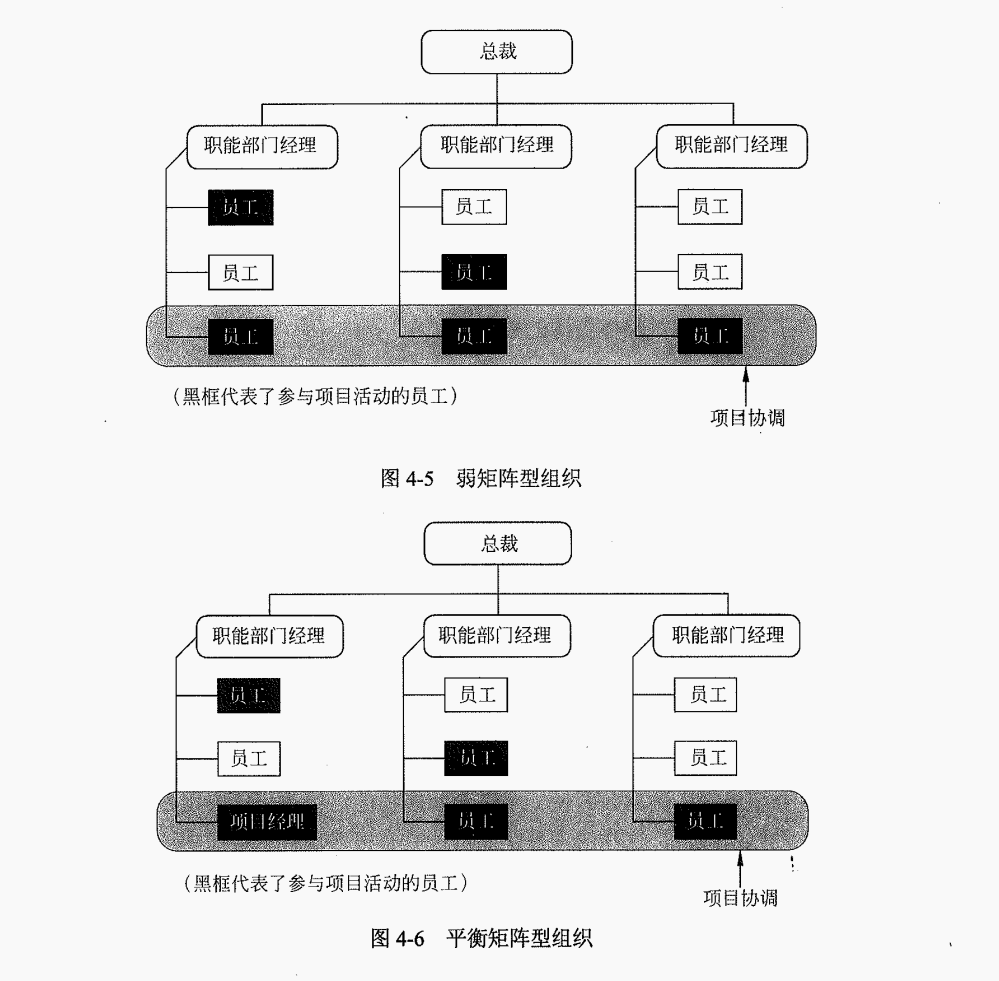

    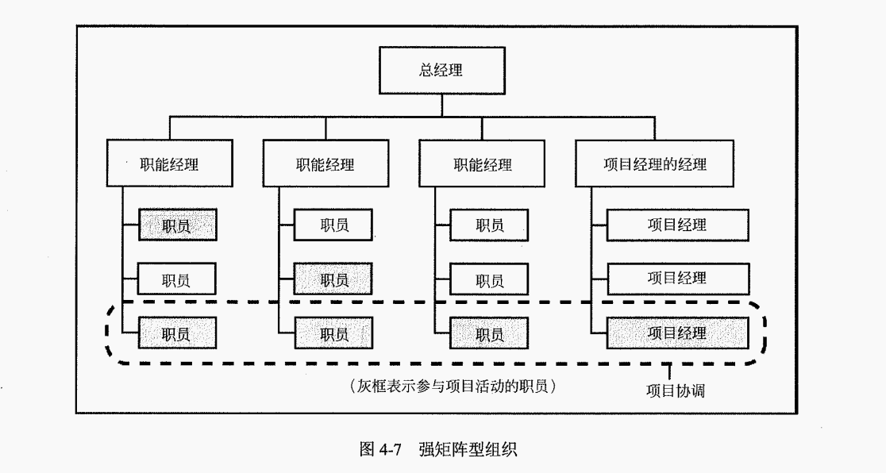

    矩阵型组织的**优点**：

    1. 项目经理负责制、有明确的项目目标。
    2. 改善了项目经理对整体资源的控制。
    3. 及时响应。
    4. 获得职能组织更多的支持。
    5. 最大限度地利用公司的稀缺资源。
    6. 降低了跨职能部门间的协调合作难度。
    7. 使质量、成本、时间等制约因素得到更好的平衡。
    8. 团队成员有归属感，士气高，问题少。
    9. 出现的冲突较少，且易处理解决。

    **缺点**：管理成本增加；多头领导；难以监测和控制；资源分配与项目优先的问题产生冲突；权利难以保持平衡等。

4. **复合型组织**
    根据工作需要，一个组织内在运作项目时，或多或少地同时包含上述三种组织形式，这就构成了复合型组织

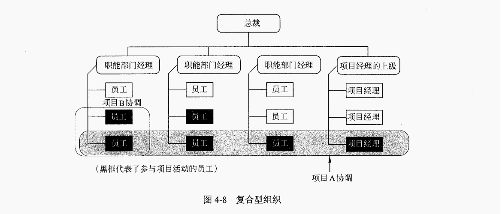基于项目的组织（Project-based Organizations,PBO)是指建立临时机构来开展工作的各种组织形式。在各种不同的组织结构中如职能型、矩阵型或项目型，都可以建立PBO。采用PBO可以减轻组织中的层级主义和官僚主义，因为在PBO中，考核工作成败的依据是最终结果，与职位或政治因素无关。在PBO中，大部分工作都被当作项目来做，可以按项目方式而非职能方式进行管理。可以在整个公司层面采用PBO,如在电信、油气、建筑、咨询和专业服务等行业中；也可以在多公司财团或网络组织中采用PBO;也可以仅在组织的某个部门或分支机构内部采用PBO。一些大型的PBO可能需要职能部门的支持。

在PBO中，大部分工作都被当作项目来做，可以按项目方式而非职能方式进行管理。可以在整个公司层面采用PBO,如在电信、油气、建筑、咨询和专业服务等行业中；也可以在多公司财团或网络组织中采用PBO;也可以仅在组织的某个部门或分支机构内部采用PBO。一些大型的PBO可能需要职能部门的支持。

#### PMO在组织结构中的作用

项目管理办公室（PMO)是在所辖范围内集中、协调地管理项目的组织内的机构。PMO也被称为“项目办公室”“大型项目管理办公室”或“大型项目办公室”。根据需要，可以为一个项目设立一个PMO,可以为一个部门设立一个PMO,也可以为一个企业设立一个PMO。这三级PMO可以在一个组织内可以同时存在。

PMO监控项目、大型项目或各类项目组合的管理。由PMO管理的项目除了彼此相关的管理外不必要有特定的关系。但在很多组织中，那些项目确实是成组的或在一定程度上相互关联的。PMO关注于其内部的项目或子项目之间的协调计划、优先级和执行情况，当然这些项目是支持PMO所在的组织或客户的整体业务目标的。

以下列出**PMO的一些关键特征**（但不限于此）：

1. 在所有PMO管理的项目之间共享和协调资源。
2. 明确和制定项目管理方法、最佳实践和标准。
3. 负责制订项目方针、流程、模板和其他共享资料。
4. 为所有项目进行集中的配置管理。
5. 对所有项目的集中的共同风险和独特风险存储库加以管理。
6. 项目工具（如企业级项目管理软件）的实施和管理中心。
7. 项目之间的沟通管理协调中心。
8. 对项目经理进行指导的平台。
9. 通常对所有PMO管理的项目的时间基线和预算进行集中监控。
10. 在项目经理和任何内部或外部的质量人员或标准化组织之间协调整体项目的质量标准。

**PMO的类型**：

1. **支持型**。支持型PMO担当顾问的角色，向项目提供模板、最佳实践、培训，以及来自其他项目的信息和经验教训。这种类型的PMO其实就是一个项目资源库，对项目的控制程度很低。
2. **控制型**。控制型PMO不仅给项目提供支持，而且通过各种手段要求项目服从PMO的管理策略，例如要求采用项目管理框架或方法论，使用特定的模板、格式和工具，或者要求项目经理服从组织对项目的治理。这种类型的PMO对项目的控制程度属于中等。
3. **指令型**。指令型PMO直接管理和控制项目。这种类型的PMO对项目的控制程度很高。

**项目经理和PMO的区别**：

1. 项目经理和PMO追求不同的目标，同样，受不同的需求所驱使。所有工作都必须在组织战略要求下进行调整。
2. 项目经理负责在项目约束条件下完成特定的项目成果性目标，而PMO是具有特殊授权的组织机构，其工作目标包含组织级的观点。
3. 项目经理关注于特定的项目目标，而PMO管理重要的大型项目范围的变化，以更好地达到经营目标。
4. 项目经理控制赋予项目的资源以最好地实现项目目标，而PMO对所有项目之间的共享组织资源进行优化使用。
5. 项目经理管理中间产品的范围、进度、费用和质量，而PMO管理整体的风险、整体的机会和所有的项目依赖关系。

### 项目生命周期

一方面，项目和项目管理是在比项目本身更大、更广泛的环境中执行的，项目经理必须理解这种更广泛的背景。另一方面，项目经理在管理一个实际项目的时候，是按照项目的各个过程开展的先后顺序来管理项目的，所以在管理一个项目之前，项目经理首先要选择适合项目生命周期的阶段、工具和过程。为了方便管理，项目经理或其所在的组织会将项目分成几个阶段来管理，以加强对项目的管理控制并建立起项目与组织的持续运营工作之间的联系。从项目开始直到项目结束，这一段时间就构成了项目的项目生命周期。在管理项目时，一般按工作出现的先后，把它们组织成一个个前后连接的阶段。也可以说，项目的所有阶段组成了项目生命周期。
下面就阐述项目管理中的流程因素，包括项目生命周期、阶段和过程。

#### 项目生命周期的特征

项目开始直至结束的时间段就构成了项目生命周期。

通常从技术上可以这样来划分阶段：立项（系统规划）、开发（系统分析、系统设计、系统实施）、运维及消亡四个阶段。
阶段的交付物通常都经过技术正确性的评审，并在下一阶段开始前得到批准。阶段之间要完成技术交接或移交。在实际工作中，无论是软件项目还是信息系统集成项目，工程技术人员一般都是按照上述技术工作来划分项目阶段的。

也可以按管理活动出现的先后，把项目的生命周期划分为启动、计划、执行和收尾等4个典型的阶段。针对一个具体的项目，根据项目管理的需要，其项目的阶段可以不止4个。

无论从技术视角还是从管理视角来划分项目的阶段，项目的每个阶段都至少包含管理工作和技术工作。

项目生命周期通常定义如下：

- 每个阶段应完成哪些技术工作？(例如，在哪个阶段应完成架构的工作？)
- 每个阶段的交付物应何时产生？对每个交付物如何进行评审、验证和确认？
- 每个阶段都有哪些人员参与？(例如，并发工程要求需求分析人员和设计人员的参与。）
- 如何控制和批准每个阶段？

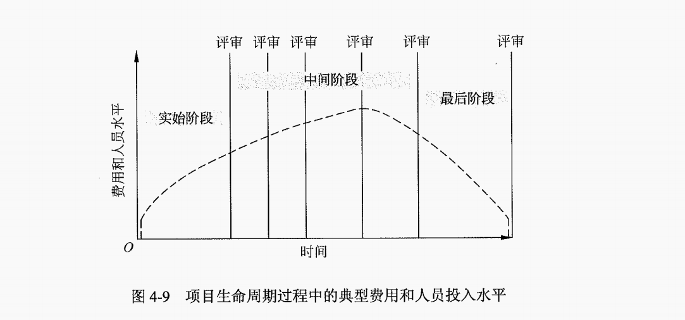

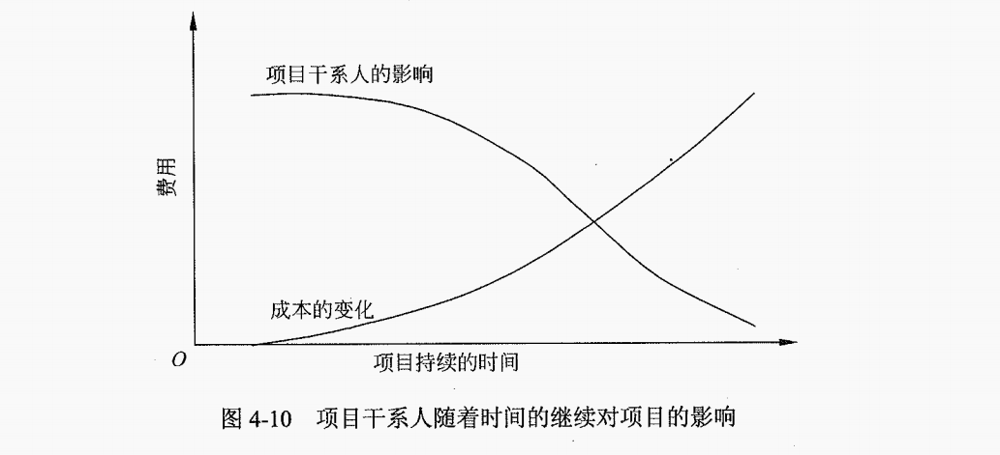

**信息系统项目的生命周期**，如果详细划分，一般可划分为**可行性分析、业务流程优化或变革、信息系统规划、系统需求分析、系统设计、系统实现、系统测试、系统实施、系统试运行、验收**等阶段。

开发完成的信息系统的生命周期，除包含前期的项目生命周期外，还包括验收后的协调运营与维护、系统退役等阶段。根据行业特点、企事业单位的规模、项目特点等对这些阶段可以有不同程度的增删和裁剪。

#### 项目阶段的特征

每个项目阶段都以一个或一个以上的可交付物的完成为标志，这种可交付物是一种可度量、可验证的工作成果，如一份规格说明书、可行性研究报告、详细设计文档、产品模块或工作样品。某些可交付物可以对应于项目管理过程，其他可交付物可能是项目的最终产品或最终产品的组成部件。

项目阶段是一个用来确保对项目的适当控制、为了获得项目目标要求的产品或服务而在项目生命周期中划出的一个时间段，在这个时间段
中，一般要完成若干可交付物。

项目阶段由连续过程组成，这些过程按一定的顺序前后相连。项目的或项目阶段的产品、成果和服务通称为可交付成果。

项目阶段的结束前，一般要对完成的工作和可交付物进行技术或设计评审，根据评审结果，以决定是否接受，是否还要做额外的工作或是否要结束这个阶段。

在不结束当前阶段就开展下一阶段工作的时候，通常需要对此决定进行管理评审，

一个项目阶段可以在没有决定启动任何其他阶段的时候就结束，为了有效地控制，每个阶段都要明确该阶段的任务作为正式启动。

在获得授权的情况下，阶段末的评审可以结束当前阶段并启动后续阶段。有些时候一次评审就可以取得这两项授权。这样的阶段末评审通常被称为阶段出口、阶段验收或终止点。

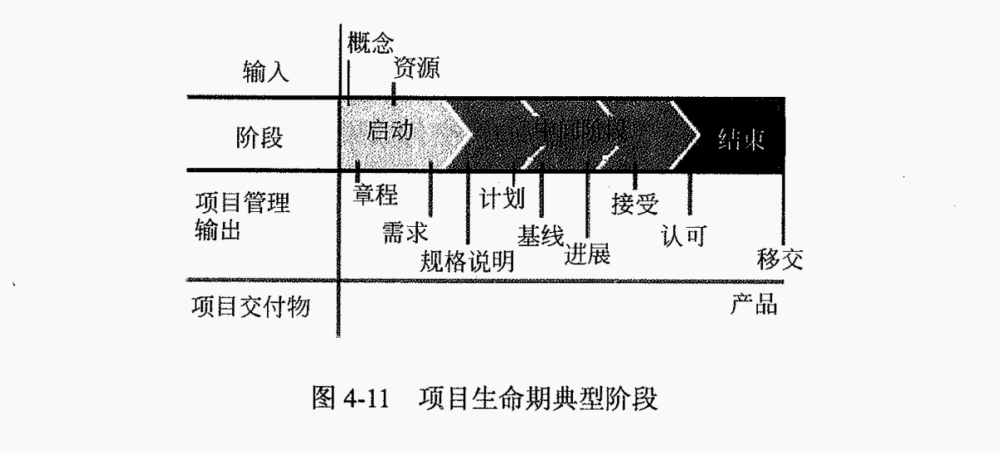

#### 项目生命周期与产品生命周期的关系

一个项目要交付特定的产品、成果和完成特定的服务。

项目生命周期定义项目的开始与结束。

假如一个项目交付特定的产品，那么该产品的生命期比项目生命周期更长，从该产品的研发（此时是项目的任务）,到该产品投入使用（或运营）,直到该产品的消亡就构成了该产品的生命周期。

许多项目与组织发展战略或正在进行的工作有关。在一些组织中，一个项目只有在完成了可行性研究、初步计划或者其他等同形式的分析之后才能正式批准。在这些案例中，初步规划或分析可以采用独立项目的形式。例如，在确定开发最终产品之前，可以将原型的开发和测试作为单独的项目。

问题、机会或业务需求是典型的激发项目的驱动力。

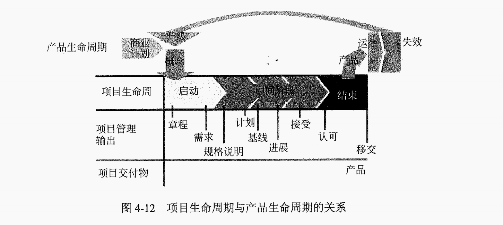

### 典型的信息系统项目的生命周期模型

**信息系统项目的生命周期模型**：这些生命周期模型均按项目的工程技术过程的先后顺序来划分的。

1. **瀑布模型**（也叫预测型生命周期、完全计划型生命周期）

    在这个模型里，在项目生命周期的尽早时间，要确定项目范围及交付此范围所需的时间和成本。项目启动时，项目团队专注于定义产品和项目的总体范围，然后制定产品（及相关可交付成果）交付计划，接着通过各阶段来执行计划。应该仔细管理项目范围变更。如果有新增范围，则需要重新计划和正式确认。

    适用场景：项目需求明确、充分了解拟交付的产品、有厚实的行业实践基础、或者整批一次性交付产品有利于干系人。

    特点：

    1. 从上一项开发活动接受其成果作为本次活动的输入。
    2. 利用这一输入，实施本次活动应完成的工作内容。
    3. 给出本次活动的工作成果，作为输出传给下一项开发活动。
    4. 对本次活动的实施工作成果进行评审。若其工作成果得到确认，则继续进行下一项开发活动；否则返回前一项，甚至更前项的活动。尽量减少多个阶段间的反复。以相对来说较小的费用来开发软件。

    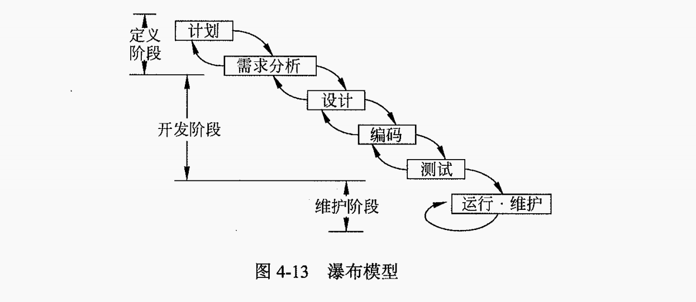

    

2. **迭代模型**

    传统的生命周期阶段是以**主要活动**命名的：需求分析、设计、编码、测试。

    传统的软件开发工作大部分强调过程的串行执行，也就是一个活动需要在前一个活动完成后才开始，从而形成一个过程串，该过程串就组成了软件项目的生命周期。

    在迭代模型中，每个阶段都执行一次传统的、完整的串行过程串，执行一次过程串就是一次迭代。每次迭代涉及的过程都包括不同比例的所有活动。

    软件统一过程（RUP）就是一种“过程方法”，它是迭代模型的一种。

    

    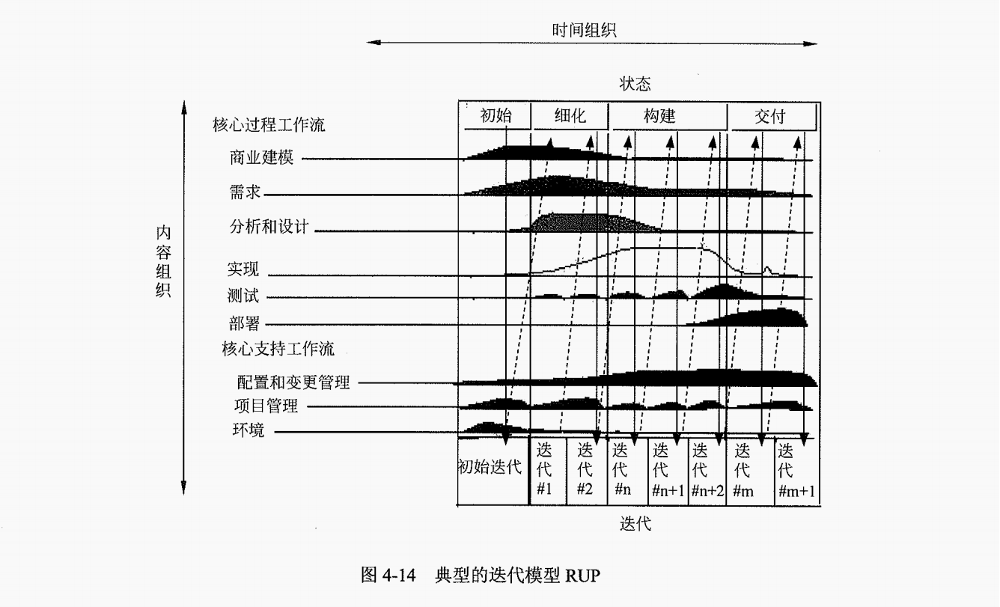

    RUP可以用二维坐标来描述。

    横轴表示时间，是项目的生命周期，体现开发过程的动态结构，主要包括周期（Cycle)、阶段（Phase)、迭代（Iteration)和里程碑（Milestone);
    纵轴表示自然的逻辑活动，体现开发过程的静态结构，主要包括活动（Activity)、产物(Artifact)、工作者（Worker)和工作流（Workflow),如图所示。

    RUP中的软件生命周期在时间上被分解为4个顺序的阶段，分别是：**初始阶段(Inception)、细化阶段（Elaboration)、构建阶段（Construction)和交付阶段（Transition)**。这4个阶段的顺序执行就形成了一个周期。

    **各阶段的主要任务**：

    1. **初始阶段**：系统地阐述项目的范围、确定项目的边界，选择可行的系统构架，计划和准备商业文件。商业文件包括验收规范、风险评估、所需资源估计、体现主要里程碑日期的阶段计划。

    2. **细化阶段**：分析问题领域，建立健全体系结构并选择构件，编制项目计划，淘汰项目中最高风险的元素。同时为项目建立支持环境，包括创建开发案例，创建模板、准则并准备工具。

    3. **构建阶段**：完成构件的开发并进行测试，把完成的构件集成为产品，测试产品所有的功能。构建阶段是一个制造过程，其重点放在管理资源及控制运作以优化成本、进度和质量。

    4. **交付阶段**：交付阶段的目的是将软件产品交付给用户群体。当本次开发的产品成熟得足够发布到最终用户时，就进入了交付阶段。（交付阶段的重点是确保软件对最终用户是可用的。交付阶段可以跨越几次迭代，包括为发布做准备的产品测试，基于用户反馈的少量的调整。）

        软件产品交付给用户使用一段时间后，如有新的需求则该开始另一个开发周期，就开始下一个的“初始、细化、构建和交付”周期。

    **适用范围**：组织需要管理不断变化的目标和范围，组织需要降低项目的复杂性，或者，产品的部分交付有利于一个或多个干系人，且不会影响最终或整批可交付成果的交付。

    **大型复杂项目通常采用迭代方式来实施，这使项目团队可以在迭代过程中综合考虑反馈意见和经验教训，从而降低项目风险。**

    

3. **敏捷方法**(又叫适应型生命周期、变更驱动方法)

    **适用场景**：适用于一开始并没有或不能完整地确定出需求和范围的项目，或者需要应对快速变化的环境，或者需求和范围难以事先确定，或者能够以有利于干系人的方式定义较小的增量改进。

    在软件项目的敏捷开发中，软件项目的构建被切分成多个子项目，各个子项目的成果都经过测试，具备集成和可运行的特征。简言之，就是把一个大项目分为多个相互联系，但也可独立运行的小项目，并分别完成，在此过程中软件一直处于可使用状态。通常2-4周迭代一次，所需的时间和资源是固定的。虽然早期的迭代更多地聚焦于计划活动，但通常在每次迭代中都会执行多个过程。

    实际工作中的项目可能有两类比较极端：

    - 一类就好比是建设奥运场馆，它是大型的、相对固定或变更较少的、需要“集团军”来完成的；
    - 另一类就好比是建设一个SNS交友网站，开发一个桌面应用软件，或设计一款时尚手机，它们是小型的、不甚确定或变更很多的、需要“特种部队”来完成的。

    项目阶段之间的关系大致有三类：顺序、重叠，以及迭代。

    

4. **V模型**

    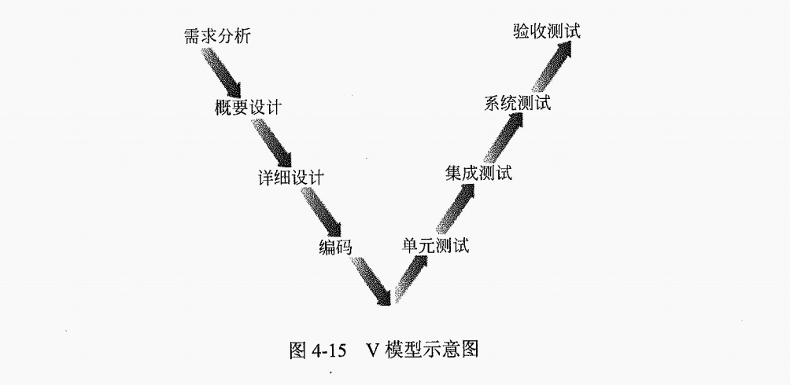

    V模型的左边下降的是开发过程各阶段，与此相对应的是右边上升的部分，即各测试过程的各个阶段。在不同的组织中对测试阶段的命名可能有所不同。

    **测试阶段和开发各阶段的对应关系：**

    1. 单元测试的主要目的是针对编码过程中可能存在的各种错误，例如用户输入验证过程中的边界值的错误。
    2. 集成测试主要目的是针对详细设计中可能存在的问题，尤其是检查各单元与其他程序部分之间的接口上可能存在的错误。
    3. 系统测试主要针对概要设计，检查系统作为一个整体是否有效地得到运行，例如在产品设置中是否能达到预期的高性能。
    4. 验收测试通常由业务专家或用户进行，以确认产品能真正符合用户业务上的需要。

5. **原型化模型**

    原型化模型是为弥补瀑布模型的不足而产生的。

    原型化模型的第一步是建造一个快速原型，实现客户或未来的用户与系统的交互，经过和用户针对原型的讨论和交流，弄清需求以便真正把握用户需要的软件产品是什么样子的。再在原型基础上开发出用户满意的产品。

    在实际中原型化经常在需求分析定义的过程进行。

    原型化模型减少了瀑布模型中因为软件需求不明确而给开发工作带来的风险，因为在原型基础上的沟通更为直观，也为需求分析和定义，提供了新的方法。

    **瀑布和V模型将原型化模型的思想用于需求分析环节**，来解决因为需求不明确而导致产品出现严重后果的缺陷。对于复杂的大型软件，开发一个原型往往达不到要求，

    为减少开发风险，在瀑布模型和原型化模型的基础上的演进，出现了螺旋模型以及大量使用的RUP。

6. **螺旋模型**

    螺旋模型是一个演化软件过程模型，其将原型实现的迭代特征与线性顺序（瀑布）模型中控制的和系统化的方面结合起来。使得软件的增量版本的快速开发成为可能。

    在螺旋模型中，软件开发是一系列的增量发布。在早期的迭代中，发布的增量可能是一个纸上的模型或原型；在以后的迭代中，被开发系统的更加完善的版本逐步产生。

    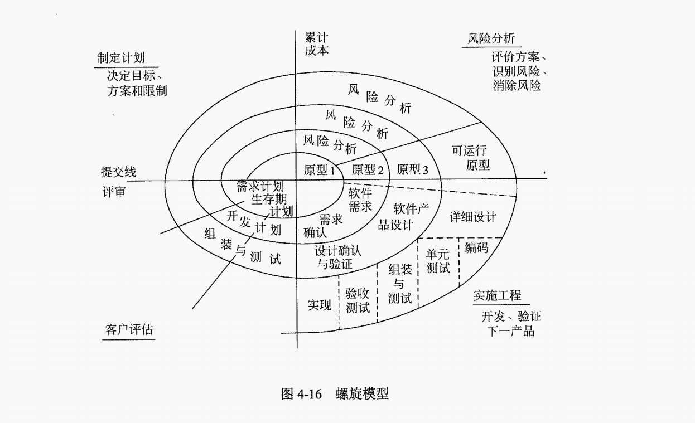

### 单个项目的管理过程

项目管理是指在项目活动中综合运用知识、技能、工具和技术以确保达成项目目标。

为了对项目的实施进行管理，项目团队必须：

1. 明确客户的需求。
2. 在管理项目时，选用达到项目目标的合适的过程。
3. 平衡范围、时间、成本、质量和风险等方面的不同要求，生产出高质量的产品。
4. 调整产品规格、计划和管理体系，以满足不同项目干系人的需求，并管理他们的期望。

一般说来，要把一个项目管好，至少需要4种过程。

1. 技术类过程（或称工程类过程）。技术过程要解决“研制特定产品、完成特定成果或提交特定服务的具体技术过程”，要回答怎么在技术上完成？怎么把产品制造出来？要回答“技术上怎么做？”。技术过程跟项目所在的行业有关，例如信息系统项目的技术过程有“需求分析”“总体设计”“编码”“测试”“布线”“组网”等。
2. 管理类过程。大多数行业的项目都有共同的管理过程。按出现的时间先后划分，管理过程可以被分为启动、计划、执行、监控和收尾过程组。
3. 支持类过程。例如配置管理过程就属于支持类过程。
4. 改进类过程。例如总结经验教训、部署改进等过程。

#### 项目过程

管理项目的方法不止一种。实施项目的细节必须基于项目复杂度、风险、规模、时间框架、项目团队经验、历史信息数量、组织的项目管理成熟度、行业和应用领域等因素来完成。

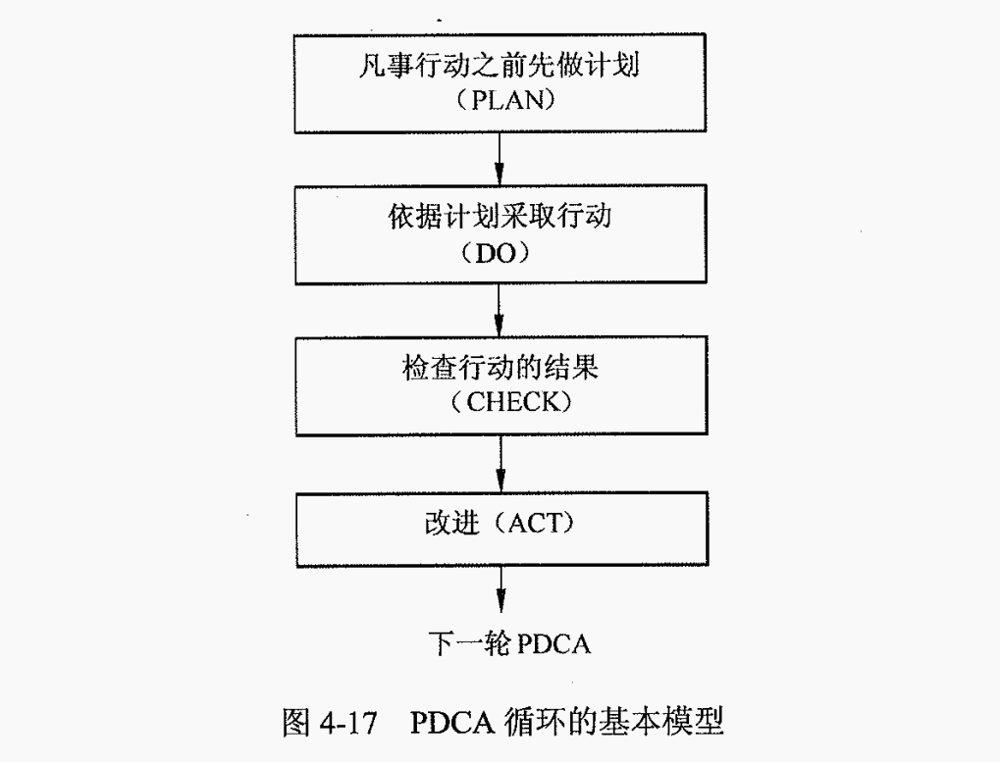

简历中项目的大致内容：

技术栈怎么写：

先写基础知识

设计模式算法

框架相关

项目

## 技术概念英文缩写、简称

------

**信息技术基础架构库**：ITIL（Information Technology Infrastructure Library)

**IT服务管理**:  ITSM (IT Service Management)

**信息技术服务标维**:  ITSS (Information Technology Service Standards)

**信息及相关技术控制目标**：COBIT(Control Objectives for Information and related Technology）

**统一建模语言**:  UML(Unified Modeling Language)

**统一软件开发过程**：RUP (Rational Unified Process)

**数据仓库**：Data Warehouse

**Web服务**：Web Services

**简单对象访问协议**：(Simple Object Access Protocal，SOAP)

**Web服务描述语言**：(Web Services Description Language, WSDL)

**统一描述、发现及集成**：(Universal Description Discovery and Integration，UDDI)

**JavaEE**： (Java Platform Enterprise Edition)

**公共对象请求代理架构**：(Common Object Request Broker Architecture，CORBA)

**网络存储技术**：(Network Storage Technology，NST)

**国际项目管理协会**：(International Public Management Association，IPMA)

**国际项目管理专业资质认证**：(International Project Management Professional，IPMP)

**项目管理办公室**：（Project Management Office,PMO)

**基于项目的组织**：（Project-based Organizations,PBO)

**软件统一过程**：(Rational Unified Process，RUP)

​				

 
